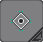
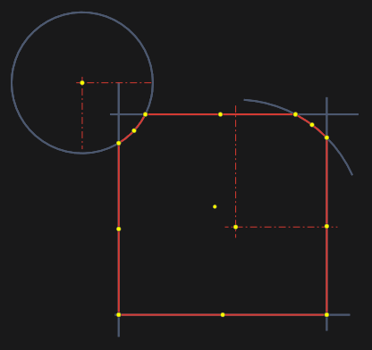
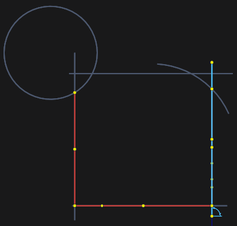
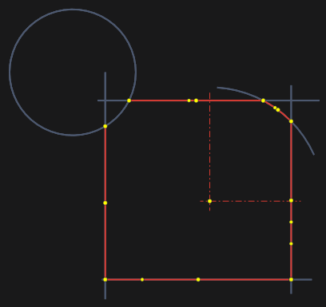

# By zone or border

In this method, the contour is built on the already existing elements.

When specifying a point inside a group of elements, a cont will be created. The components of this contour are located in this zone.

When selecting the contour boundary, its elements will be created automatically along the chain to the nearest intersection with another object.

To continue the contour, select its next element. If the specified element is not connected to the previously built one, the system will try to complete it along the chain.

