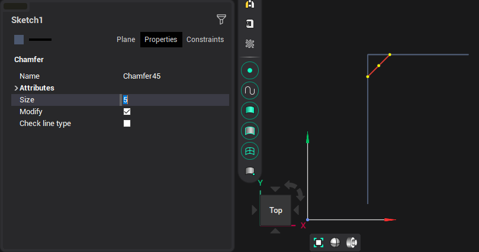
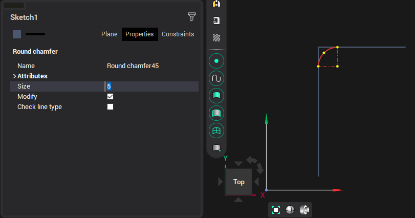

# Chamfer and Rounding

These two objects are built automatically. You just need to move the cursor to the intersection of two objects, enter the size value and click the mouse button to complete the construction. If for some reason the system cannot build the required element, then the elements must be sequentially selected.

<strong>Chamfer</strong>

<strong>Rounding</strong>

It is also possible to build chamfers and roundings between arcs.

If you double-click on a rectangle or contour, then all corners of such element will be rounded.

