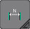
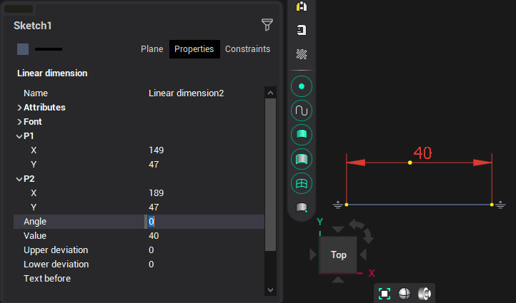
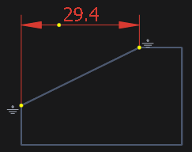

# Linear dimension

When constructing a linear dimension, you must specify the start and end points, the size of the leader, and the offset of the beginning of dimension text relative to the first extension line. The dimension value is calculated automatically. The inspector sets the slope of the dimension line relative to the x-axis, the values of the upper and lower deviations, the text before and after the dimension value, and the text font.

It is also possible to create a linear dimension by specifying an existing line. In this case, you do not need to specify the start and end points, and the system will have a link between the dimension and the line. Subsequent editing of a line or dimension will change both objects.

If the dimension line is not horizontal or vertical and needs to be normalized, press <strong>[Shift]</strong> while constructing the dimension.

