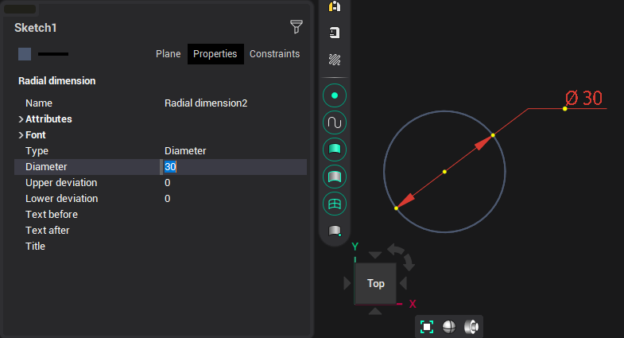
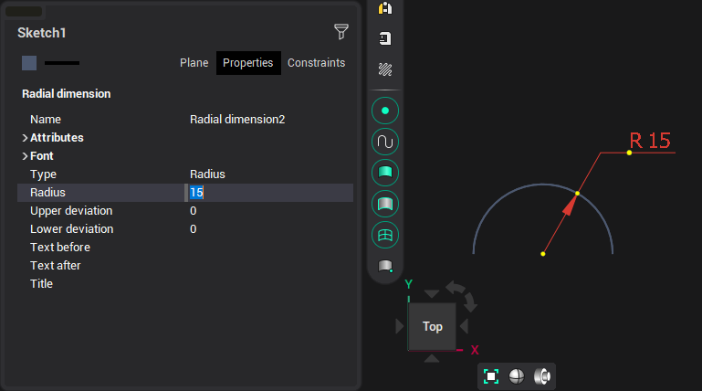

# Radial dimension

To construct a radial dimension, you need to specify an existing circle or arc and the point where the text starts. The dimension value will be automatically determined. The inspector sets the top and bottom tolerances, the text before and after the dimension value, and the font of the text.

When dimensioning a circle, by default, a dimension of the <strong>Diameter</strong> type will be built, as in the picture above. When dimensioning an arc, a dimension of the <strong>Radius</strong> type will be built by default:

You can switch the type in the field of the same name at any time.

Just as in the case of a linear dimension, the system will determine the connection of these objects and further editing of one of them will change the other.
