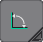
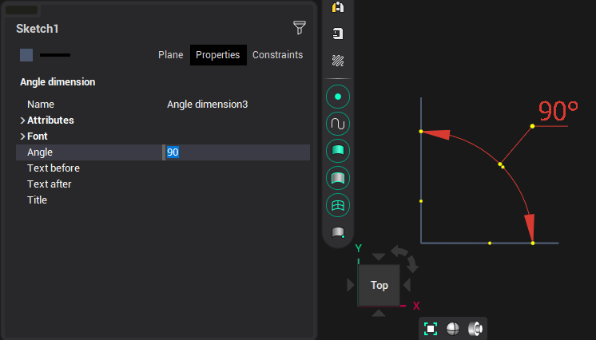

# Angular dimension

To build an angular dimension, you must sequentially specify two lines and the start point of the text. The dimension value will be automatically determined. The inspector sets the text before and after the size value and the font of the text.

As a result of construction, the system will have a link between the dimension and the lines. Subsequent editing of a line or dimension will change both objects.
