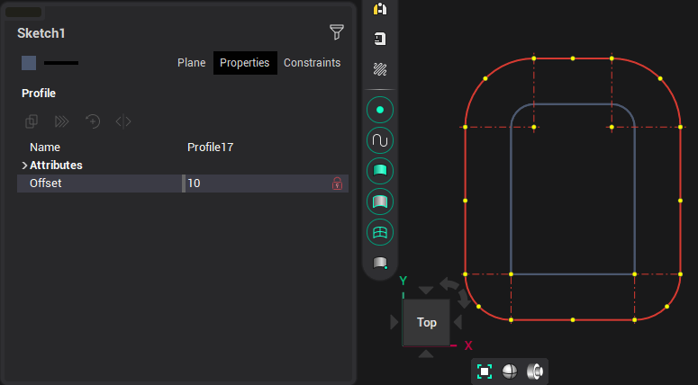
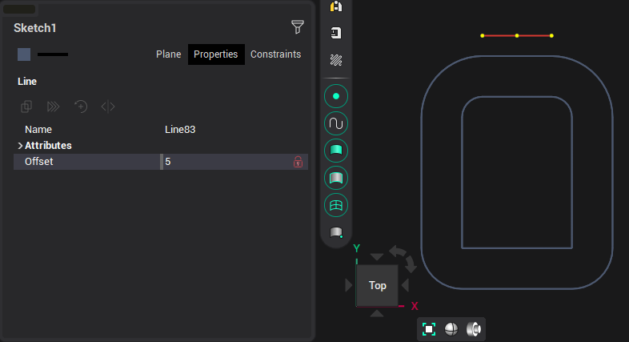

# Offset

This function creates an offset object to the previously created one.

Offset can be built both interactively and by entering an offset value from the original object. The new object will be the same type as the original.

If <strong>Ctrl</strong> was pressed when selecting a compound object ([rectangle](20009.md), [contour](20013.md)), then only the specified side ([line](20001.md) or [arc](20002.md)) will be selected to build the offset, and not the entire object.

