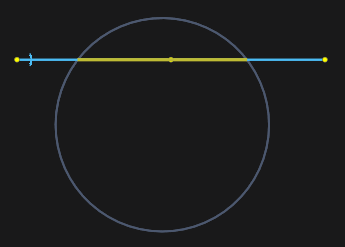
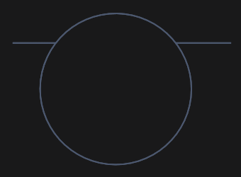
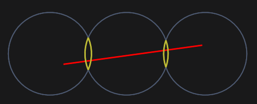
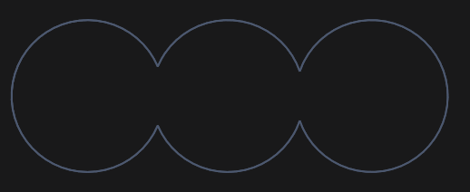

# Trim function

The function finds the intersection points of the specified element with others and highlights the area that will be deleted after confirmation by clicking.

After confirmation:

You can also cut fragments of several elements at once by pressing the mouse button and dragging.

All intersections of objects with this imaginary line will be removed after releasing the mouse button:

