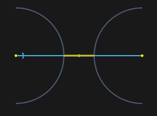

# Split object

The function converts the specified compound element ([rectangle](20009.md), [contour](20013.md), [named block](20029.md)) into its parts. If a block is pointed, it will be split into the elements from which it was built.

If you select an elementary object ([line](20001.md), [arc](20002.md), [circle](20006.md)), this element will be split into several at the intersection points with other elements.

