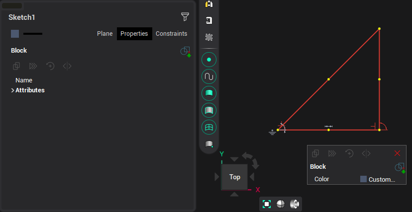

# Additional functions

Additional functions are available when editing single objects and blocks. Their activation buttons are located in the inspector and the pop-up menu, which is called by the right mouse button.

