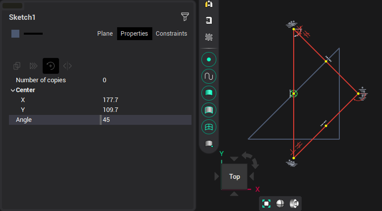

# Rotate

The object is rotated around the specified point by the specified angle. Rotate can be done interactively or by specifying the coordinates and angle in the inspector. In addition, you can specify the number of copies, and each next copy will be rotated by the specified value from the previous one.

