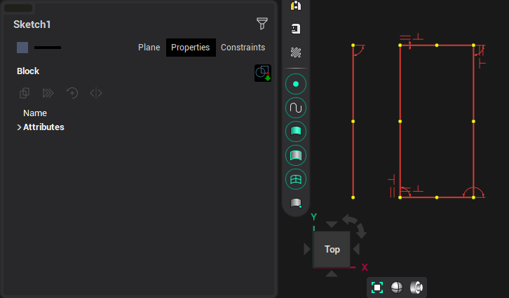
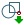
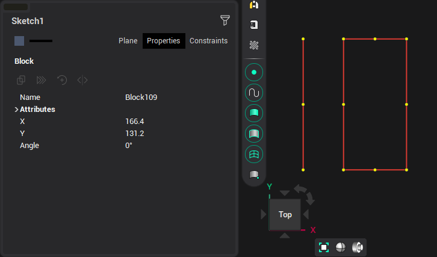
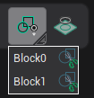
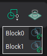

# Named block

To create a named block, you need to select the necessary elements in the block. To do this, by pressing the mouse button and holding it down, select the elements with a rectangular frame, or sequentially select the elements with the <strong>[Shift]</strong> key pressed. The exclusion of elements from the block is also performed by specifying these elements with the <strong>[Shift]</strong> key pressed.

Click the  button in inspector. If necessary, you can enter its name or set the rotation angle of the block.

In the future, you can insert this block into the drawing by hovering over the corresponding button and selecting the desired block from the drop-down menu.

Subsequently, you can edit the original block by clicking the "scissors" in the menu. All copies of the edited block will also change.

