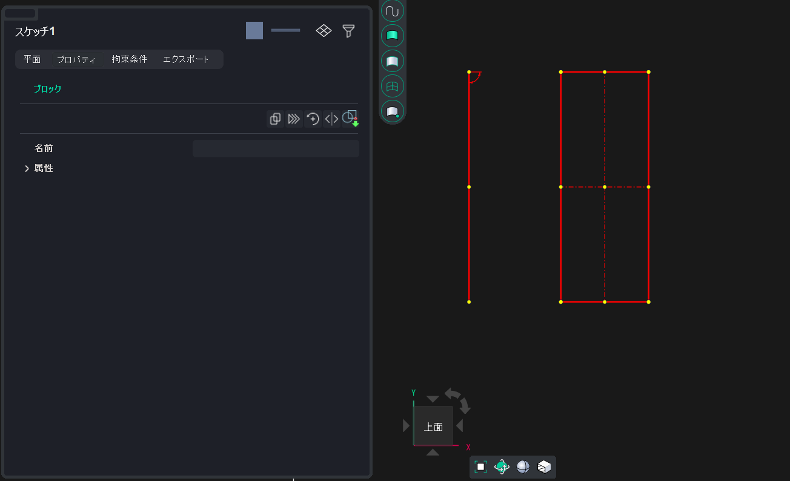
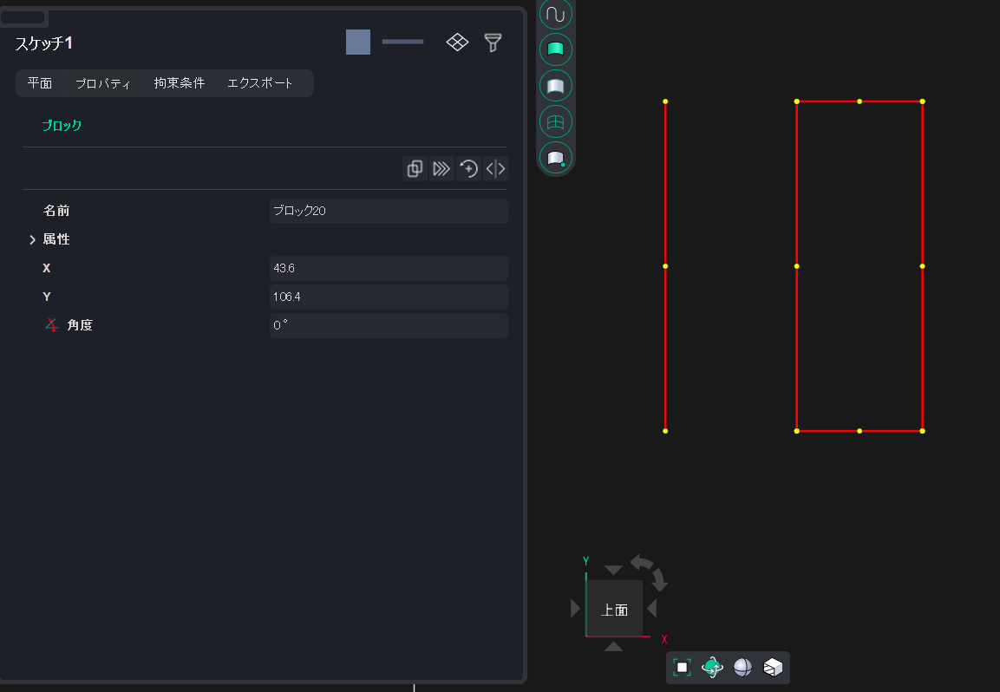
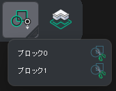

# 名前付きブロック

名前付きブロックを作成するには、ブロック内の必要な要素を選択する必要があります。要素の選択は、マウスボタンを押したまま、長方形枠で要素を選択するか、 <strong>[Shift]</strong> キーを押しながら要素を順に選択します。ブロックから要素を除外する場合も、 <strong>[Shift]</strong> キーを押しながら要素を順に指定します。

インスペクターの  ボタンをクリックします。必要に応じて、ブロック名を入力したり、ブロックの回転角度を設定することができます。

今後、作成したブロックは、対応するボタンにカーソルを合わせ、ドロップダウンメニューから必要なブロックを選択することで、図面に挿入することができます。

その後、メニューの「はさみ」をクリックすることで、元のブロックを編集することができます。編集したブロックのすべてのコピーも同様に変更されます。

