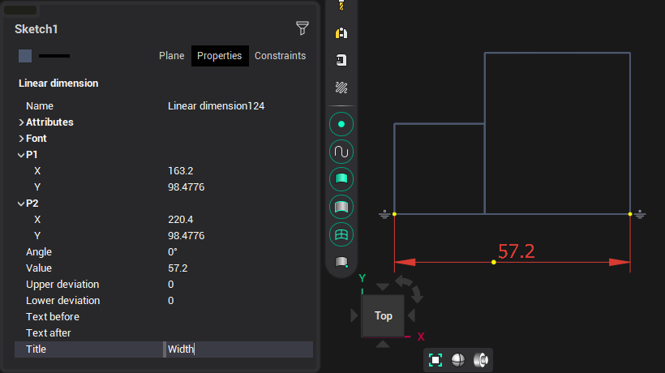
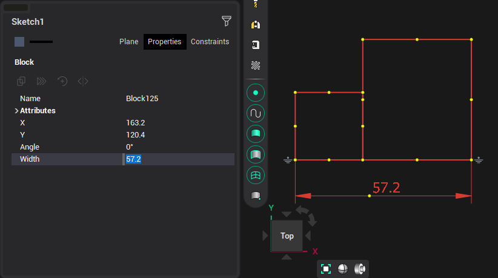

# Block parameterization

Before combining the elements into a block, enter the values you need in the <strong>[Title]</strong> fields of the sizes.

After merging the elements, these parameters will appear in the inspector and will be available for editing.

