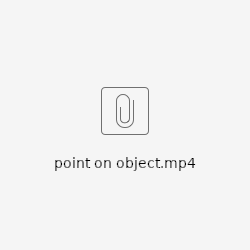
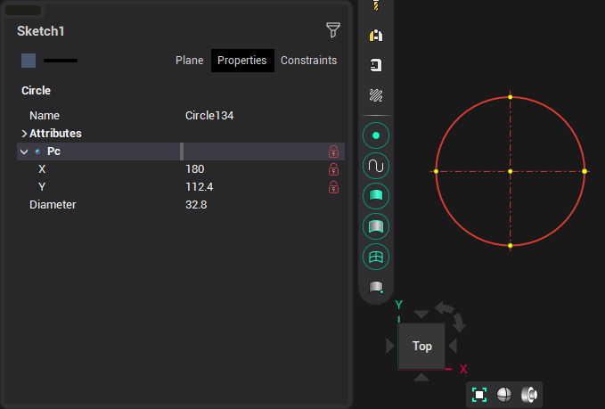
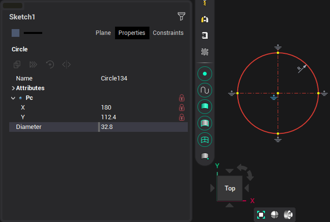
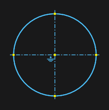

# Constraints

Constrains are created during the build process and are removed during editing when the link conditions are lost. For example, the line has ceased to be parallel or the touch has disappeared.

In the process of editing a block, the c onstrains are preserved and the objects change in accordance with them. That is, tangency, parallelism of lines, etc. is saved.

Constrain types:

- Tangency

During construction, while pressing <strong>[Ctrl]</strong>, select the object to which this c onstrain will be applied. For example: a circle touches a line, or a line segment touches a circle or arc.

When constructing a line, in addition to tangency, it is set that the point lies on the circle.

- Point on a circle, line, arc.

When constructing, if the point is on the object, then the corresponding connection is created. If the point during construction coincides with the point of another object, then 2 joint connections are created and the point becomes common when editing the block.

- Parallel, perpendicular

If during the construction process with pressed <strong>[Ctrl]</strong> move the cursor to the line, then auxiliary lines for construction will appear and a link will be set. You can also set the link in the inspector on the <strong>Links</strong> tab, and if the lines did not meet this criterion, they will be adjusted.

- Alignment

The lines lie on the same straight line. You can get this connection as a result of trimming. You can also set such a link in the inspector on the <strong>Links</strong> tab.

- Fixing

You can fix points by X, Y coordinates, separately or together. You can fix the length, radius, corners, height and width of the rectangle. You can fix it with the buttons in the inspector:

Or by anchors in the drawing:

For dimensions, you can fix the value <strong>Value,</strong> <strong>Radius,</strong> <strong>Angle</strong> in the inspector. This affects how elements behave when edited in block mode - this size does not change.

- Axes

If, when constructing a line, by double-clicking on an arc or a circle, axes will be drawn that will follow the change in this element.

- Equality

The equality of segments, radii of arcs, circles is set when copying with replication. You can also set such a link in the inspector on the <strong>Links</strong> tab.

- Linear size

A binding of a linear dimension is created when it is assigned to a line. Subsequent editing of the segment will also adjust the size.

- Point coincide

Such a connection is created during construction, when the points of the objects coincide. You can also set such a link in the inspector on the <strong>Links</strong> tab.

- Object-forming links

They are used to connect created complex objects, such as a contour, a radial dimension, an angular dimension, a rectangle, a fillet, a chamfer, a script. The link persists as long as the original object exists.
