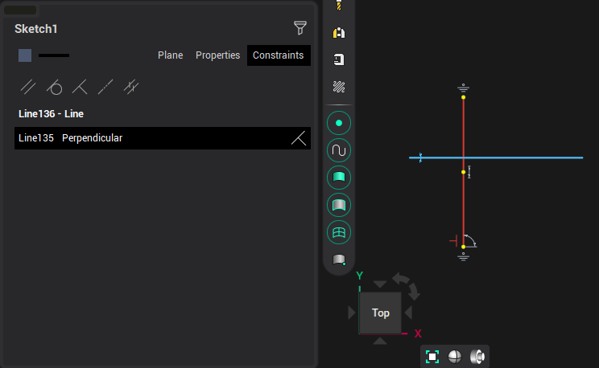
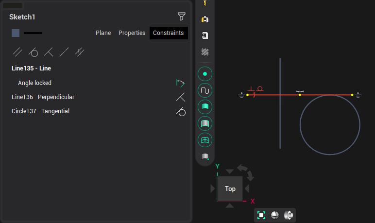
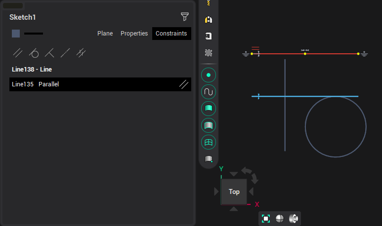

# Editing links in a block

In the inspector, in the <strong>Constraints</strong> tab, a list of the active element's links is shown.

In block mode, you can disable / enable the restriction by clicking on the link image.

To create links <strong>Parallelism,</strong> <strong>Tangency,</strong> <strong>Perpendicularity,</strong> <strong>Coaxiality,</strong> <strong>Equality</strong> in block mode, press the corresponding button and sequentially select a pair of objects.

Releasing the button will return the link enable/disable mode. After exiting the block mode, disconnected links are permanently disabled.
