# Example of building a drawing using constrains

As example, let's take the same drawing as previously:

To begin with, from the point 0,0 we build three circles with an arbitrary radius, but more or less respecting the scale. From the center we draw a line at an arbitrary angle for the circle R4. We do not comply with the dimensions - then we will bring them to those indicated on the drawing. We build a circle and rotate with copying at an angle of 41 °, having previously indicated the center of rotation at the point 0.0. Next, we build axes to the resulting circles and arrange the angular and radial dimensions:

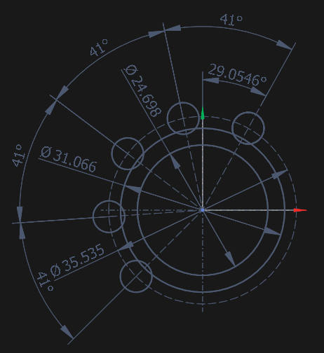

Trimming off the excess:

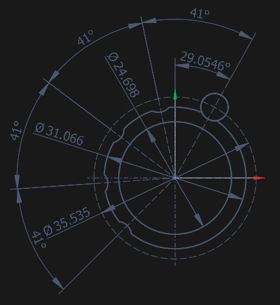

Now select the entire drawing with the key combination <strong>[Ctrl-A]</strong> and change the radius of the circle to 4, then change the angle to 30. After that, fix the angles of the segments and angular dimensions of 41°, after which we again select all the elements in the block and set the values of the diameters according to the drawing:

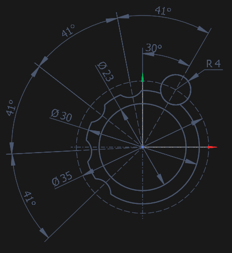

We fix the radii of the previously constructed circles and the resulting arcs. Next, we extend the circle axis to the right with a margin for further constructions. We build a circle with a center on the resulting line with a margin, then we cut off the excess and measure it:

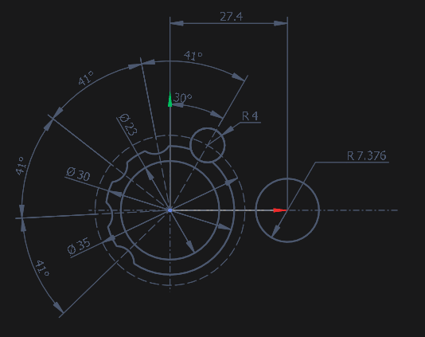

We fix the center of the arc Ø30, select a group of elements into a block, activate a new circle in the block. Next, in the inspector, in the <strong>Constraints</strong> tab, add the constraint <strong>Tangential to the circle</strong> and specify the part of the circle Ø30, set the radius according to the drawing and fix it:

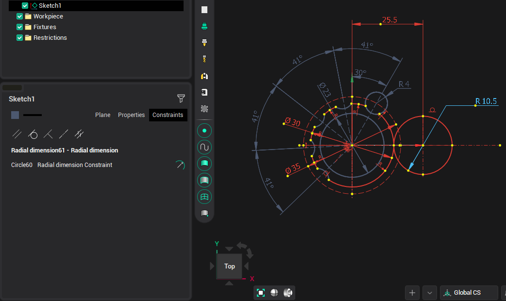

At the resulting circle, you can fix its center. Next, on the axis we build a small circle with a diameter of 3.5 and build a linear dimension from the zero point to its center. In the block, we expose according to the drawing and fix the center. We build a vertical axis for a circle of 3.5 and equidistant from this axis at a distance of 1.5 to build a point inside an arc with a diameter of 5.7 and fix its angle:

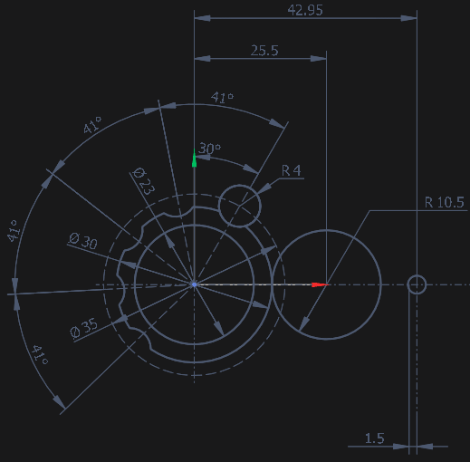

Now we build an auxiliary line for the size 50.1 from the zero point, adjust the size and build an auxiliary circle with a radius of 3.5:

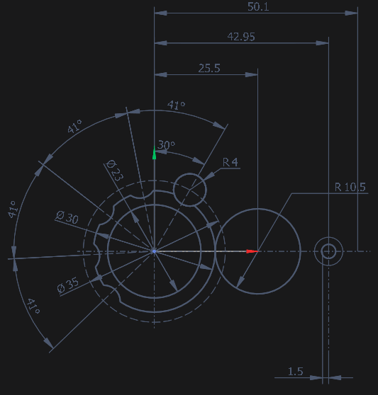

We build a vertical size and set it to 7.2 in the block, after fixing the top point. We build a line tangent to the auxiliary circle with a radius of 3.5, which would intersect the auxiliary line just above the axis. We cut off the auxiliary line and build a circle with the center at the resulting point and passing through the intersection point of the tangent and the vertical at 65.4. We measure the resulting circle:

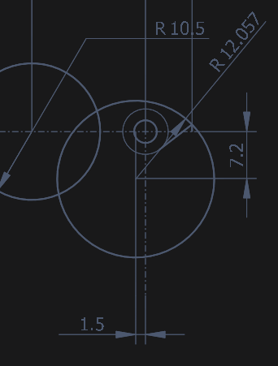

In the block, set the radius to 11.71, then build an arc with a radius of 7 tangent to the circles R10.5 and R11.71, cut off the excess.

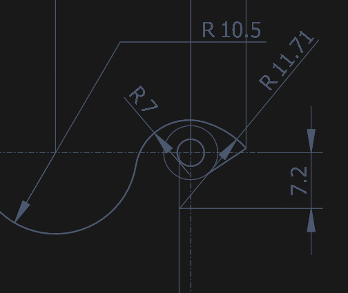

To build the arc R5.7 and R0.4, we extend the inclined line and build an equidistant line to it at a distance of 5.7, and from it another one at a distance of 0.8, connect the first two with a line and enter an arc between them. We build a time line passing through the center of a small circle and parallel to the third line, and from it equidistant and also enter a small arc. We measure the received elements, delete and cut off the excess.

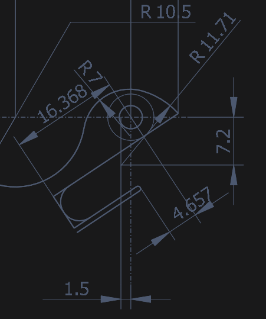

We fix the angles of the lines, and the points of the dimensions lying in the center of the circle and in the block are changed to the values from the drawing.

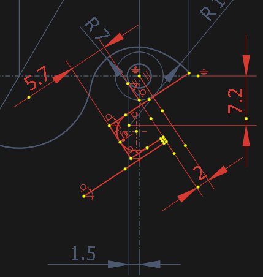

We cut off the excess or change the line type.

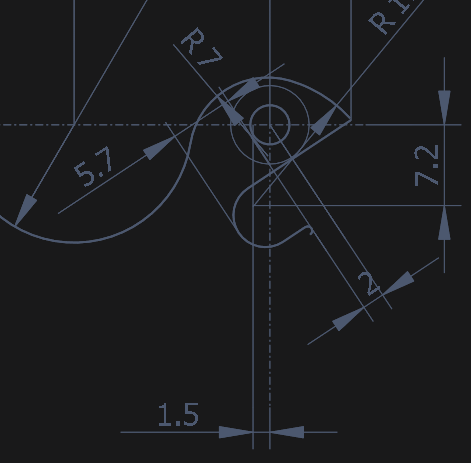

Conjugate arc R0.4 and left circle with R30 arc R50. We cut off the excess from the arc R0.4

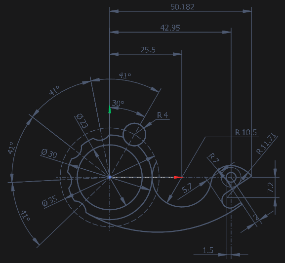

Now we build 3 arcs parallel to R50, R10.5 and R30, fix the centers and match them with arcs, set the dimensions and cut off the excess.

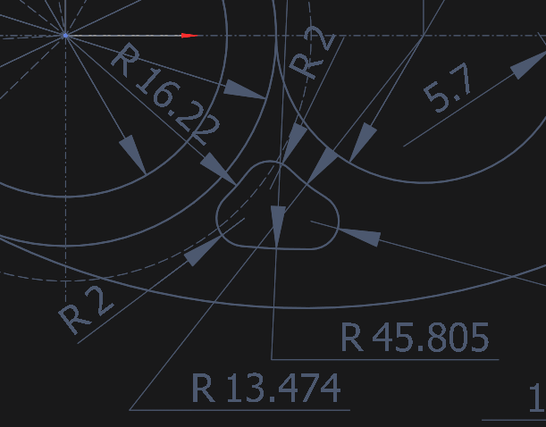

In the block, we set the dimensions according to the drawing. First, we set the radii for large arcs and fix the radius after each adjustment. Next, set the radius of rounding:

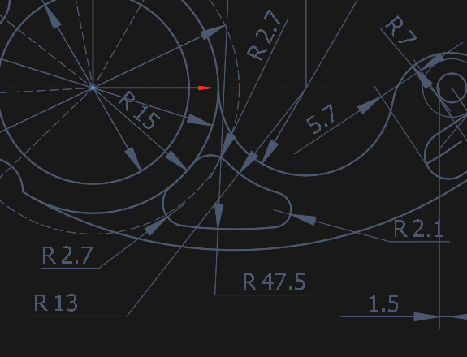

Thus, we got the required drawing.

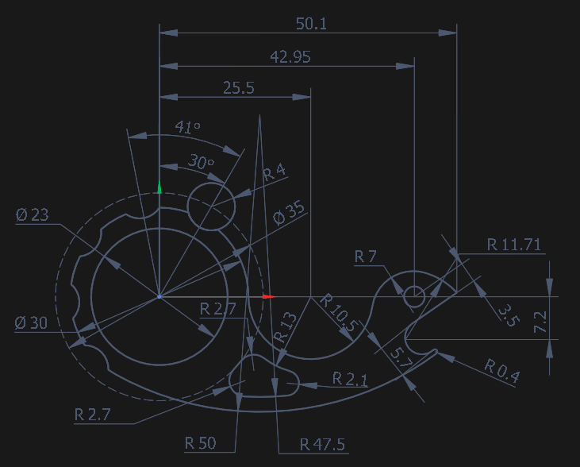
