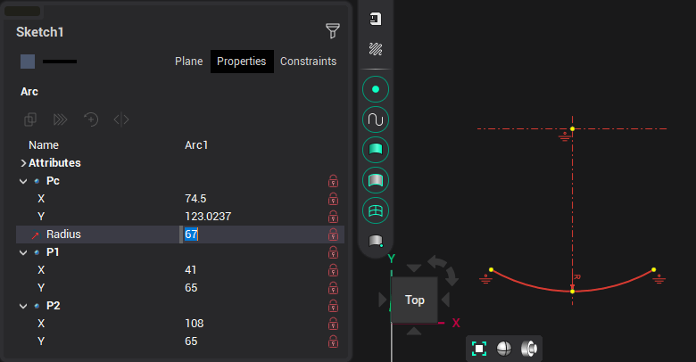

# Edit arc

Selected arc object can be modified by directly moving points in graphical window or by changing parameters in inspector panel.

When editing an arc, all parameters can be fixed by clicking the "lock" symbol in the inspector, or the corresponding icon on the arc itself. Axis lines for the arc can be added by selecting <strong>Line</strong> and double-clicking on the arc.

When editing an arc, it is possible to use the help of guide lines. By default, guides are offered from the first or second point at angles of 0°, 45°, 90° and relative to the center and midpoint of the arc in editing mode.

In addition, you can create guides by holding the cursor over a point on a previously created object.
