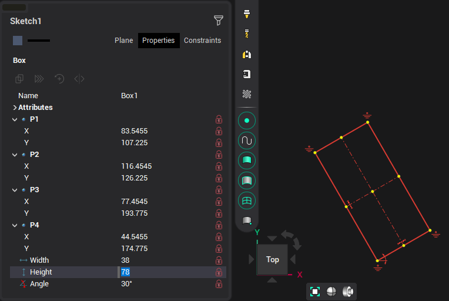
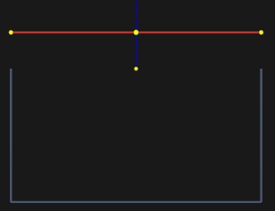

# Edit rectangle

Selected rectangle object can be modified in graphical window or you can change it's parameters in the inspector.

When editing a rectangle, all these parameters can be fixed by clicking the "lock" symbol in the inspector, or the appropriate icon on the rectangle itself.

When editing a rectangle by moving it's points, you can use the help of guide lines. By default, guides are offered from the point being edited and the opposite point at angles of 0°, 45°, 90° and along a straight line passing through these points.

You can select a line that is part of rectangle by holding the <strong>[Ctrl]</strong> key while clicking that line in the graphic window. If you "tear off" the line from the rectangle, the rectangle will be split into lines.

