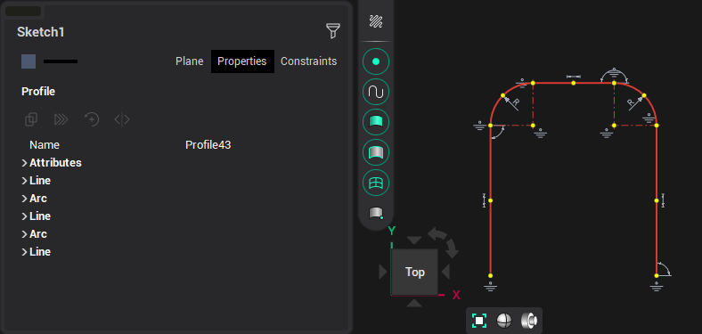
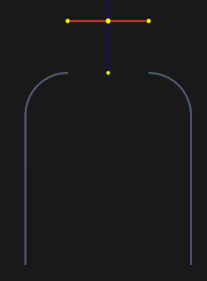

# Edit contour

Selected contour can be modified by changing it's points in graphic window. You can change contour elements properties in the inspector.

In edit mode, the contour will be presented as a set of lines and arcs.

If you select the side of the contour with pressed <strong>Ctrl,</strong> only the highlighted contour element will be selected. If you separate an element from a contour the contour will be split into elements.

