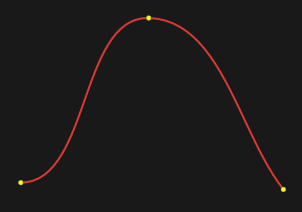
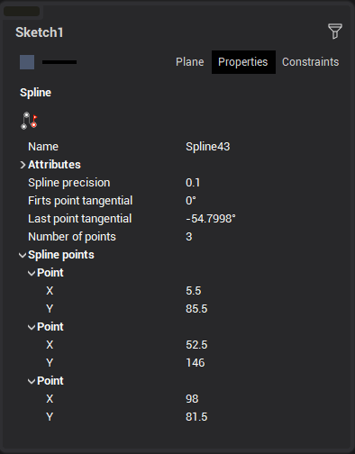

# Spline

Spline is a piecewise curve interpolation with lines. Spline passes through given points and is tangential to given start and end angles.

It is possible to input spline points directly in the graphic window. Otherwise the left inspector can be used to input number of points and point coordinates.

Click  or double-click at last point to finish spline.
