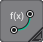
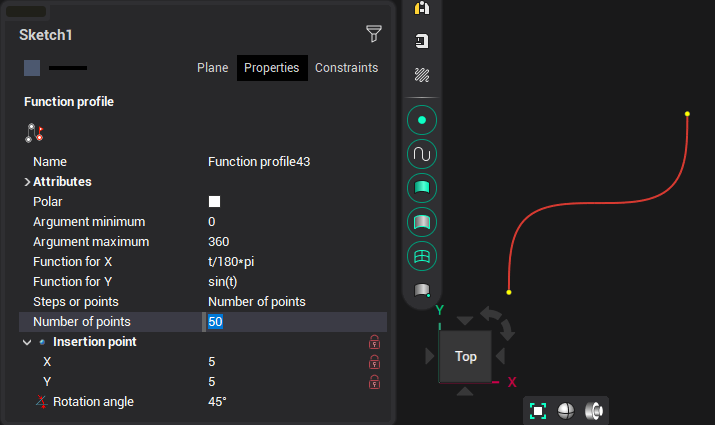
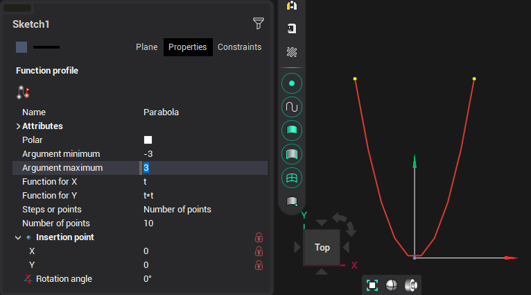

# Function profile

Create curve that passes through points whose coordinates are calculated by expression provided by user.

Points are calculated by substituting <strong>t</strong> with values from <strong>Argument minimum</strong> to <strong>maximum</strong> into expressions for <strong>X</strong> and <strong>Y</strong>. It is possible to set curve insertion point and add rotation around that point.

Click the  button or click in the graphic window to finish curve definition.

Expressions recognizes common mathematical functions:

- sin(t) - sine of <strong>t</strong>
- cos(t) - cosine of <strong>t</strong>
- tan(t) - tangent of <strong>t</strong>
- cotan(t) - cotangent of <strong>t</strong>
- arctan(t) - arc-tangent of <strong>t</strong>

For trigonometrical functions the argument is in radians. <strong>Pi</strong> is the <strong>π</strong> number.

- exp(t) - <strong>e</strong> raised to the power of <strong>t</strong>
- ln(t) - natural logarithm of <strong>t</strong>
- sqrt - square root of <strong>t</strong>

## Examples of function profiles

### Quadratic function (parabola): Y = X2

### Exponential: Y = 10x

###
