# Point welding

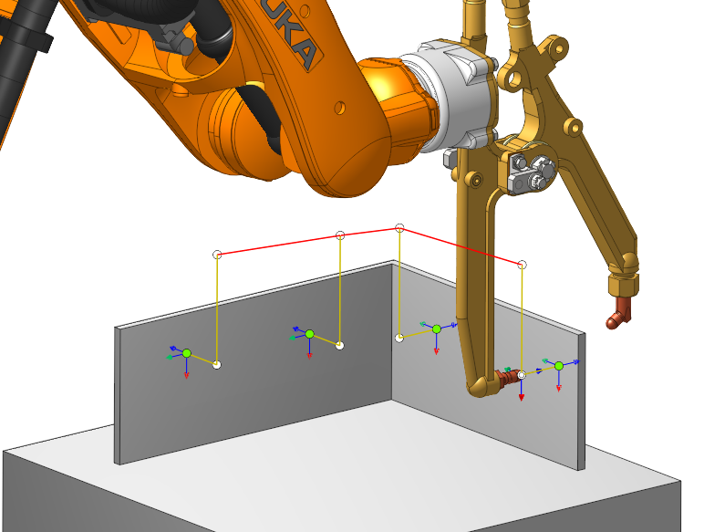

Operation can be used to  <strong>Tack weld</strong> and 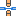 <strong>Spot weld.</strong>

#### Job assignment

In the strategy tab, you need to select the type of welding:  Tack weld

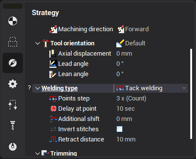

 Spot weld

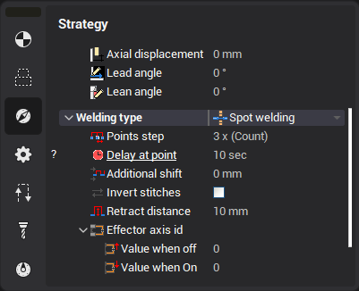

For both types the job assignment is the same.

The <strong>job assignment 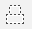</strong> consists of two types of points:

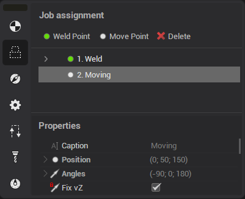

 Weld Point  Move Point

These points can be used to construct a chain of trajectories:

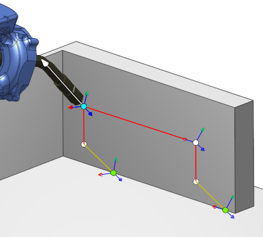

<strong>Drag points</strong>

These points can be moved by dragging.

They attach to faces 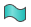, curves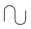, splines, edges, vertices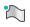. Tool axis rotates automatically when attached.

<strong>Move points</strong> can be easily moved using <strong>Smart snap </strong>:

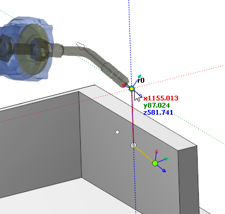

Position of the point can also be specified as an offset from the auxiliary yellow point.

To do this, first select the yellow point:

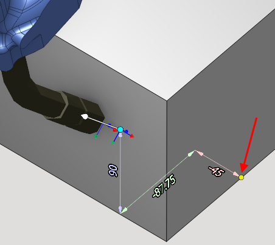

You can also rotate the axis vector by dragging the visual vector:

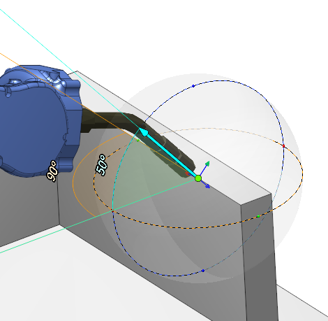

<strong>Point parameters</strong>

Points contains the following parameters:

 Weld Point

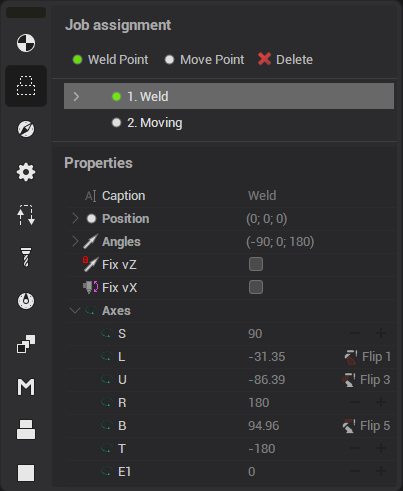

 Move Point

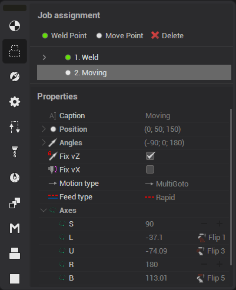

 Caption - point name

 Position - point coordinates.

 Angles - tool axis inclination angle at point

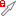 Fix vZ - if enabled point vector does not change when dragged

 Fix vX - enable 6 axis edit mode:

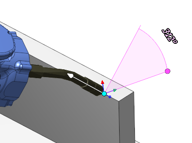

 Motion type - is set by what type to move to the point: MultiGoto - Multi coordinate movement  PhysicGoto - Physical machine axes movement  Avoid collisions - Collision avoidance movement

 Axes - machine axis at the current point.

When changing axes, two buttons appear:

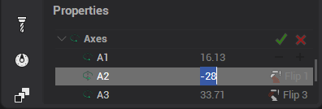

-  - moves the point to the tip of the machine

-  - returns previous values

- 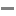  - 360/+360

 Flip - controls flips in the robot

<strong>Auxiliary Point</strong>

 Weld point also contains additional auxiliary points:Clearence Engage Retract

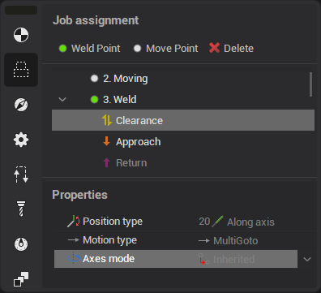

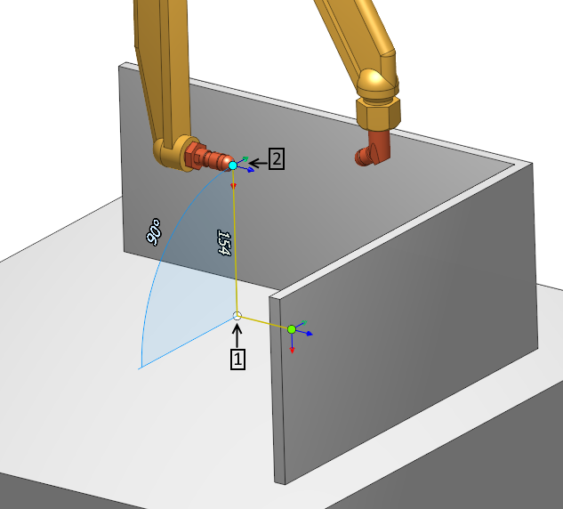
