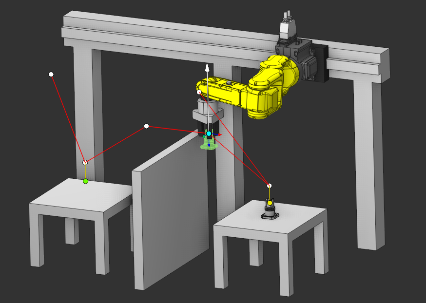
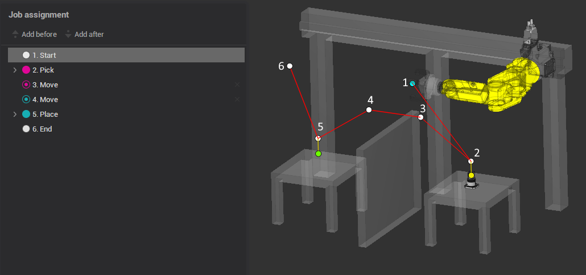
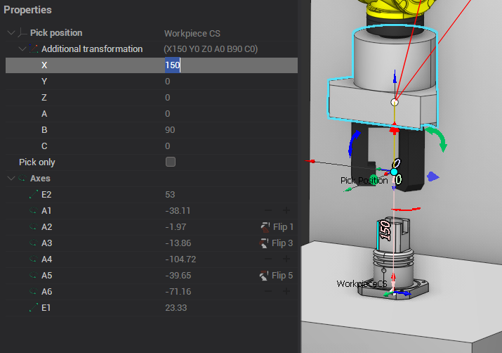
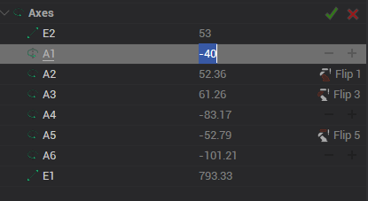
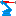
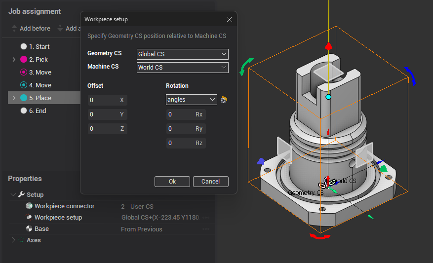
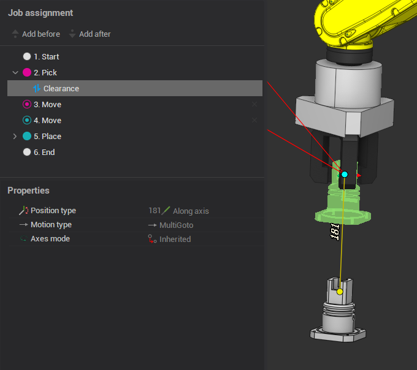

# Point Pick-and-Place

It's based on the [Pick-and-place](10404.md) operation.

The <strong>job assignment </strong> is built on nodal points. At points, a position is set for moving the machine. By adding and removing points, you can set the desired movement of the part.

A <strong>job assignment</strong> consists of several types of points:

1.  Start point
2.  Pick point
3.  Move point (relative to Pick point)
4.  Move point (relative to Place point)
5.  Place point
6.  End point These points can be used to construct a chain of trajectories.

1.  Start point It is read-only. This is the end point of the previous operation
2.  Pick point The grip position of the part. Properties:  Pick position is defined in geometry coordinate system with <strong>additional transformations.</strong> if <strong>Pick only</strong> is selected, the trajectory stops at this point.  Axes - machine axis at the current point. When changing axes, two buttons appear:   - moves the point to the tip of the machine  - returns previous values   - 360/+360  Flip - controls flips in the robot
3.  Move point (relative to Pick point) The page has buttons "Add position before" and Add position after" to add intermediate points. By default, points are added relative to the selected one. if you change the initial position of the part, then by default this point will also move. Properties:  Fix vX - enable 6 axis edit mode:   Motion type - is set by what type to move to the point:
  - MultiGoto - Multi coordinate movement
  -  PhysicGoto - Physical machine axes movement
  -  Avoid collisions - Collision avoidance movement
4.  Move point (relative to Place point) Differs from the previous point in that the point moves with the end position of the part.
5.  Place point Position where the part should be placed. The position where the part is to be placed is defined by the [workpiece connector](54.md) and [workpiece setup](10066.md). All movements of the gripper is generated in the defined [workpiece coordinate system](726.md). 
6.  End point This is a return to the tool change point. If it is off, then the trajectory ends at a Place point.

<strong>Clearance point</strong>

Using these points you can define the length and the direction for the engage/retract movements to the pick and/or place positions.

 How to drag points in interactive can be found in [Point Welding operation](20041.md)
