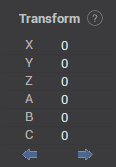

# Working with splines

## Ways to select multiple points

1. Use box selection.
2. Hold Shift and click on a point to select the continuous range of points from the last selected point to the clicked point.
3. Hold Ctrl and click to select multiple points individually

## Delete points

Right click on a point or press the **DELETE** key on keyboard to delete all the selected poitns

## Undo and Redo

Press `Ctrl+Z` to undo the last action, press `Shift+Ctrl+Z` to redo the last action.

## Transform the spline or the selected points of the spline

With the transformation panel you can move or rotate the spline or its selected points by the specified offset distance along/around the XYZ axes of the current coordinate system.

