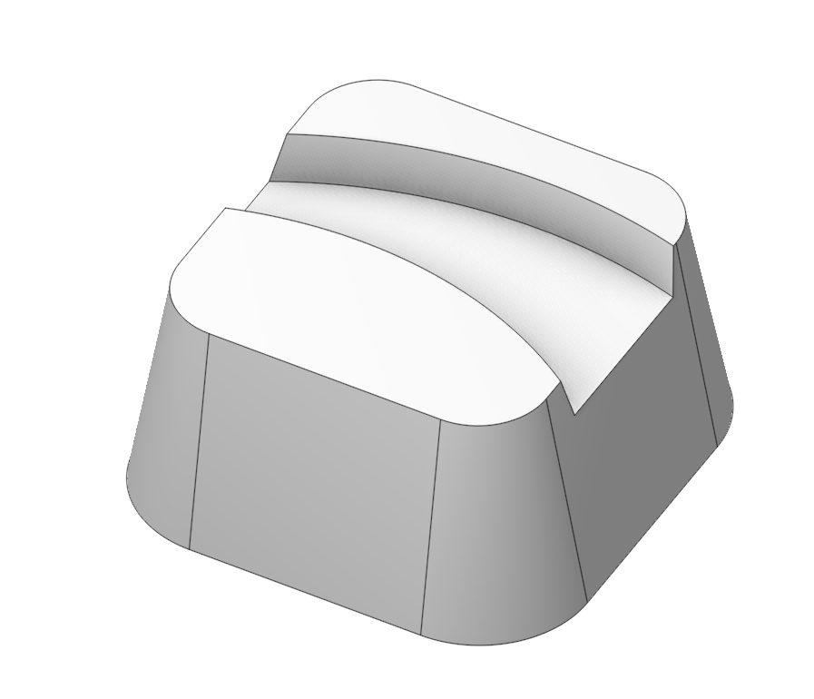
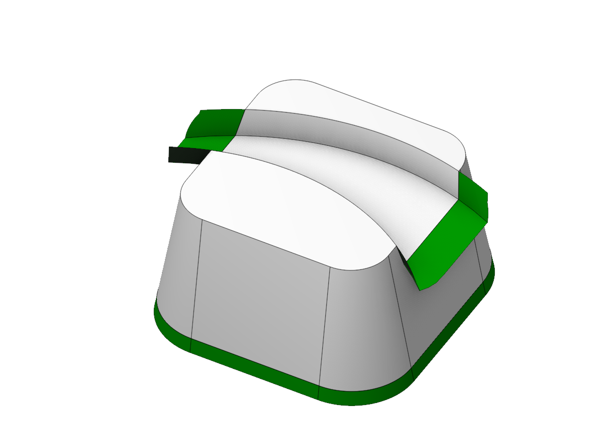
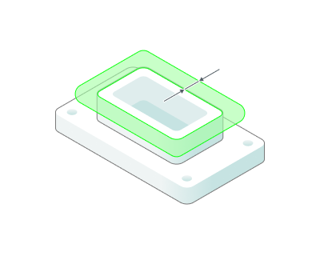
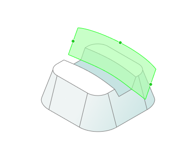
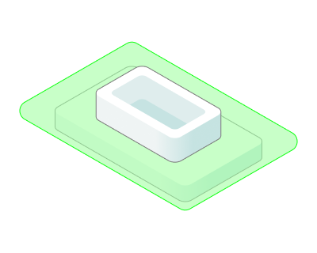

# Extend surface

 

## Application area:

The technology allows to expand the original surfaces and expand the edges along which the surfaces are completed. Available in model mode on the top panel. Select the edges of the surfaces you want to extend.

<strong>Extension distance.</strong> The value to which it is necessary to extend

<strong>Extension type.</strong> Extension method

<strong>Equidistant to edges.</strong> The original surfaces are extended (due to the fact that some surfaces are twisted, extension is impossible)

.png)

<strong>Interpolation of tangent edges.</strong> First the edges are extended, then the surface is completed along them.

.png)

<strong>Surface UV Box.</strong> Allows you to create UV space of the surface. This surface has interactive elements to change its area. It is necessary to select a surface.

Options not available: <strong>Alternate from side, With source face.</strong>

<strong>Alternate front side.</strong> Сhoice of which side of the rib to extend the surface.

.png) .png)

<strong>With source face.</strong> The extended surface forms a single surface with a copy of the original surface

.png) .png)

<strong>Hole capping.</strong> Closes holes with a "radius" below a given value on the original surface

.png) 
