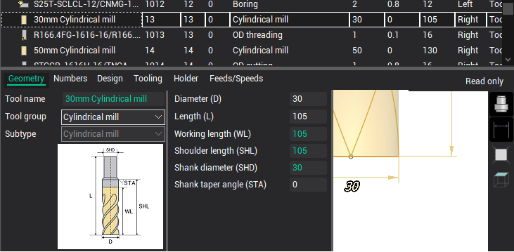
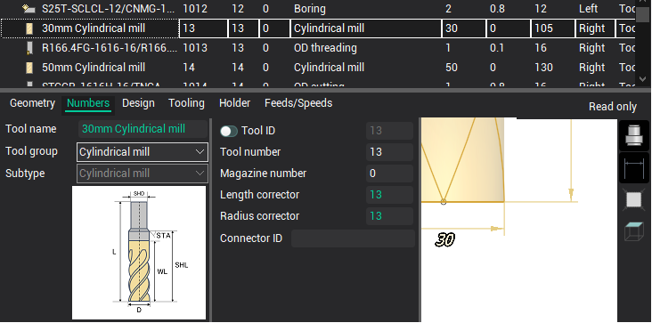
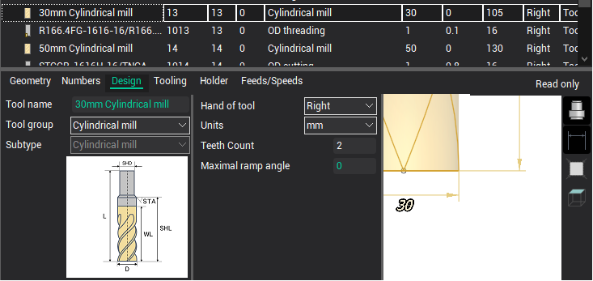
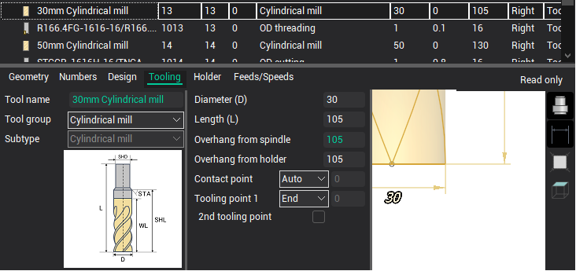
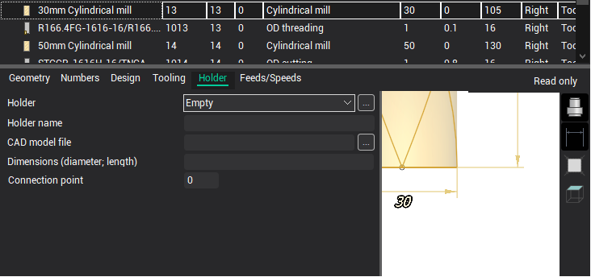
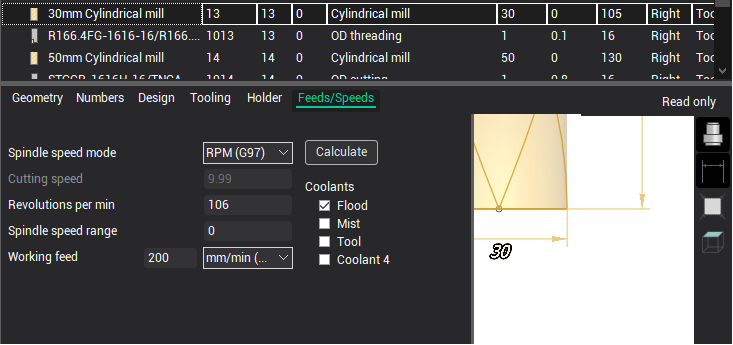

# Milling tool editing

When you select a milling tool in the [Tools window](38.md), a panel with its properties is displayed in the lower part of the window, as shown in the figure above.

The system implements the following types of milling tools, which differ in the list of available geometric parameters:

- Cylindrical mill;
- Spherical mill;
- Torus mill;
- Double radius mill;
- Limited double radius mill;
- Conical mill;
- Mill with negative radius;
- Limited conical mill;
- Engraver;
- Drill;
- Cutter;
- Tap;
- Thread mill;
- Center drill;
- Countersink;
- Т-slot mill;
- [Shaped mill](10343.md);
- Knife;
- Saw blade;
- Probing;
- Spray;
- etc.

You need to select the group and subtype of the tool correctly to see the list of its geometric properties in the window on the Geometry tab.

On the Numbers page, the tool identifier properties are displayed.

- ID is a unique tool identifier independent of its location on the machine.
- Tool number - the tool number on the machine. Usually corresponds to the position number in which the tool is fixed on the machine.
- The tool magazine number is used if there are more than one magazines on the machine.
- The corrector number for the length and for the radius is the record number corresponding to the tool in the tool offset table in the machine.

The following parameters are listed on the Design page.

- The number of teeth.
- Maximal plunge angle
- Tool units (mm or inch).
- Tool durability in minutes.

The Tooling tab contains such parameters.

- Tool overhang - distance from tool fixing point in spindle to tool tip.
- Tooling point 1 - point on the tool, the movement of which is defined by the G-code relative to zero of the part.
- Tooling point 2 - used with some types of tools to ensure that the G-code is independent of the size of the tool.
- Tool contact point - point on the tool with which it should primarily touch the geometric elements specified in the job assignment of the operation.

The Holder page allows you to set the parameters of the holder.

- Holder - drop-down list of holders from current library and project.
- Holder name - arbitrary text string.
- Holder dimensions - a sequence of pairs of numbers separated by a semicolon, defining the diameter and length for each of the steps.
- Connect point - distance from the highest point of the holder to the connection point of the holder with the machine spindle.
- CAD-model file. The button opens a standard file selection window. You can specify files in the format *.stl and *.osd. Sets the 3D model of the holder for visualization and control of collisions during simulation.
- Clicking on the "..." button opens a new [dialog for selecting and editing the holder](10341.md).

On the Feeds/Speeds tab you can edit such parameters as

- Spindle rotation mode: constant revolutions or constant surface speed.
- Cutting speed.
- Spindle revolutions.
- Spindle speed range.
- Spindle rotation direction.
- The value and dimension of the working feed.
- Enabled cooling tubes.

