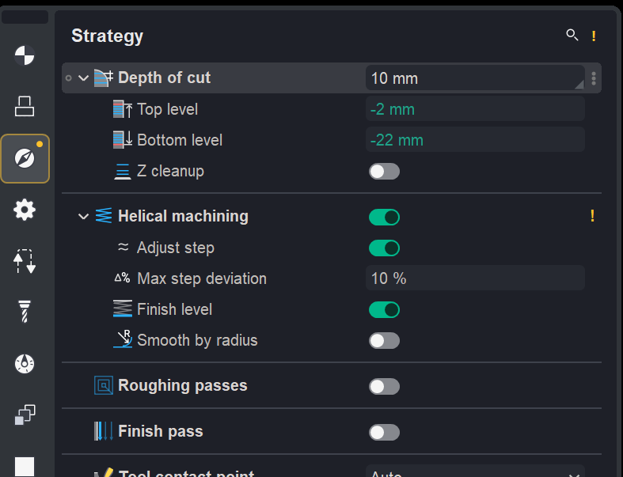

# Toolpath recalculation control

## Application area:

**Toolpath recalculation control** is used to identify differences between the current operation parameters and the values used to calculate the existing toolpath.

The function helps locate edited parameters, restore the previously calculated parameter state, and update the affected parts of the toolpath when a full recalculation is not required.

## Changed parameter indicators:

**Calculated parameter state.** The CAM system saves the operation's parameter values when the toolpath is calculated. These values are used to identify subsequent changes.

**Operation status.** A **yellow warning status** indicates that the current operation parameters differ from those used to calculate its toolpath.

**Inspector indicators.** Changed parameters, their groups, and the corresponding inspector pages are marked to help locate settings that require recalculation.

<figure>

<figcaption><em>Changed parameter indicators on the <strong>Strategy</strong> page.</em></figcaption>
</figure>

## Recalculation and parameter restoration:

**Partial recalculation.** If the parameter changes do not require a full recalculation, the calculated toolpath is preserved. Only the affected parts, such as links, approaches, and retracts, are updated.

**Parameter restoration.** Before recalculation, the parameter values used to calculate the current toolpath can be restored.

## Settings:

**Auto-reset toolpath.** The setting for hiding the parameter change hints is located in **System setup** > **Additional** > **Auto-reset toolpath**.
