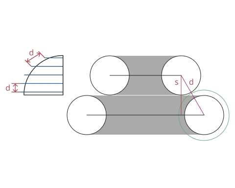
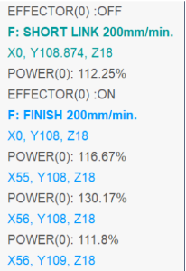
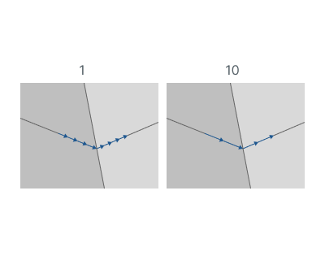

# Power

<strong>Green circle</strong> — real extruded material, <strong>black</strong> <strong>circle</strong> — theoretical extruded material.

<strong>S</strong> - Horizontal step

<strong>d</strong> - Step on the plane

## Application area:

This option adjusts the extruder speed based on layer height, modifying the <strong>Power (material feed)</strong> parameter.Using the link, you can learn how to work with the <strong>POWER</strong> command in the postprocessor. [Details](https://docs.encycam.com/Inp/2/en/1020.html)

This is calculated as follows:

<strong>Power = d/S*100%</strong>

Thus, the <strong>Power</strong> function allows increasing the material feed depending on the varying step. That is, the larger the step, the more material needs to be extruded.

In CLDATA, you will see it as follows:

<strong>Max dist deviation.</strong> Interpolation parameter.

