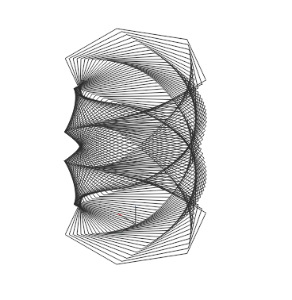
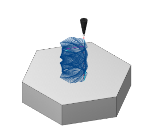
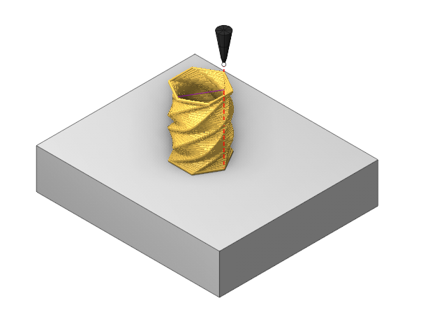

# Direct cladding

  

## Application area:

The operation lets you do surfacing along curves you've set up beforehand. You can prepare the curves using any tool — for example, a third‑party CAD program. Basically, the operation turns a bunch of curves into a path for the tool to follow. It also automatically sorts and divides the work area into regions. You can choose between layer‑by‑layer and spiral processing modes.

### Setup:

The <strong>Setup</strong> tab is used to configure the primary parameters of the project. This can involve the positioning of the part on the equipment, the coordinate system of the part, and more. [Details](1022.md)

### Job assignment:

<strong>Curve.</strong> Set the toolpath along the selected curve. [Details](707.md).

<strong>Properties.</strong> Displays the properties of an element. It is possible to add the stock. You can also call this menu by double clicking on an item in the list.

<strong>Delete.</strong> Removes an item from the list

### Strategy:

#### Printing strategy.

The choice of strategy affects the availability of parameters in the <strong>Sorting</strong> group.

Click here to expand..

<strong>Planar.</strong> Allows you to use layer-based printing options

<strong>Helical.</strong> Allows you to use spiral printing options

#### Sorting.

Toolpath sorting and linking parameters.

Click here to expand..

##### Sort by.

Allows to set printing order of layers and features.

<strong>Layers</strong>. Allows to print all features layer by layer.

<strong>Features</strong>. Allows to print all features one by one.

<strong>Split by layers.</strong> This parameter allows you to split your features into a desired number of layers. It is available only when the <strong>Sort by</strong> parameter is set to <strong>Features</strong> option.

<strong>Allow reverse direction.</strong> Changes the processing direction of a single curve.

<strong>Start point.</strong> Allows to set custom rules for deciding starting point on print layers.

<strong>Do not change.</strong> The starting point is selected automatically.

<strong>Nearest.</strong> Selects the nearest point to the instrument

<strong>Manually.</strong> The user selects the starting point interactively

<strong>Optimize order. If disabled:</strong> the curves are selected from the add list.

<strong>If enabled:</strong> the curves are selected by the shortest distance

### Transformations:

Parameter's kit of operation, which allow to execute converting of coordinates for calculated within operation the trajectory of the tool. [Details](10168.md)

### Part:

A Part is a group of geometrical elements that defines the space to check for gouges. [Details](330.md)

### Workpiece:

A workpiece model of an operation defines the material to be machined. [Details](738.md)

### Fixtures:

As the Fixtures the fixing aids such as chucks, grips, clamps, etc., and the restriction areas of any other nature are usually specified. [Details](10283.md)

### Download:

Select the latest version and download the  <strong>DirectCladdingOperationExtension.dext</strong> from the Assets section.

[https://github.com/EncySoftware/DirectCladdingOperation/releases](https://github.com/EncySoftware/DirectCladdingOperation/releases)

### Installation instructions:

[https://github.com/EncySoftware/DirectCladdingOperation](https://github.com/EncySoftware/DirectCladdingOperation)
