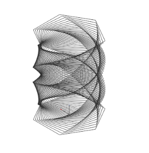
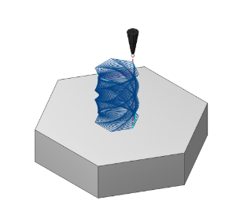
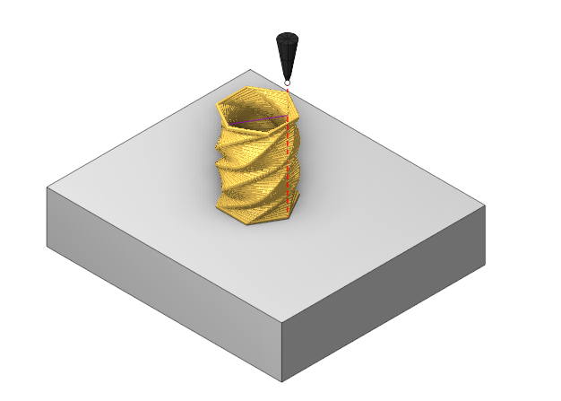
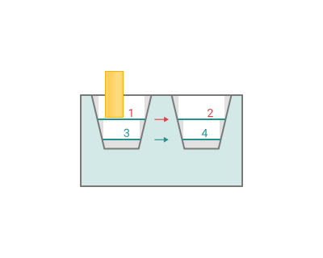
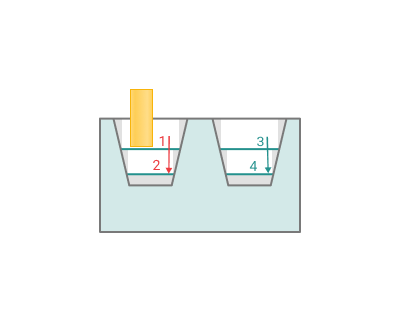

# ダイレクトクラッディング

  

## 適用分野：

このオペレーションでは、あらかじめ設定したカーブに沿ってサーフェス加工を行うことができます。カーブは任意の工具（例：サードパーティ製CAD プログラム）を使用して作成できます。基本的に、このオペレーションは複数のカーブを工具が追従するためのパスに変換します。また、加工領域を自動的に分類し、複数の領域に分割する機能も備えています。加工モードは、レイヤーごとの加工と、らせん加工から選択できます。

## セットアップ：

<strong>セットアップ</strong>タブは、 プロジェクトの主要なパラメータを設定するために使用します。これには、装置上のパーツの位置、パーツの座標系などの設定が含まれます 。[詳細を見る](1022.md)

## ジョブ割り当て

<strong>カーブ</strong> 選択したカーブに沿ってツールパスを設定します。 [詳細を見る](707.md)

<strong>プロパティ</strong> 要素のプロパティを表示します。ストックを追加することも可能です。リスト内の項目をダブルクリックすることでも、このメニューを呼び出すことができます。

<strong>削除</strong> リストから項目を削除します。

## 加工設定：

### 積層造形方法

方法の選択によって、 <strong>並べ替え</strong>グループで使用できるパラメーターが変わります。

拡大

<strong>平面</strong> レイヤー単位の造形オプションを使用できます。

<strong>ヘリカル</strong> らせん状の造形オプションを使用できます。

### 並べ替え

ツールパスの並べ替えとリンクに関するパラメータです。

拡大

###### 並べ替え

レイヤーとフィーチャーの造形順序を設定します。

<strong>レイヤー</strong> すべてのフィーチャーを、レイヤーごとに造形します。

<strong>フィーチャー</strong> すべてのフィーチャーを、一つずつ順次造形します。

<strong>レイヤーごとに分割</strong> フィーチャーを指定したレイヤー数に分割できます。<strong>並べ替え</strong>パラメータが<strong>フィーチャー</strong>に設定されている場合にのみ使用できます。

<strong>逆方向を許可</strong> 単一のカーブの加工方向を変更します。

<strong>開始点</strong> 各 造形レイヤーの開始点を決定するためのカスタムルールを設定できます。

<strong>変更なし</strong> 開始点が自動的に選択されます。

<strong>最短距離</strong> 機器の最も近い点を選択します。

<strong>手動</strong> ユーザーが開始点をインタラクティブに選択します。

<strong>順序を最適化</strong>

<strong>無効の場合</strong>： 追加リストの順序でカーブが選択されます。

<strong>有効の場合</strong>： 最短距離に基づいてカーブが選択されます。

## 変換：

オペレーション内で計算された工具の軌跡に対して座標変換 を行うためのパラメータグループです 。[詳細を見る](10168.md)

## パーツ：

パーツは、干渉をチェックする空間を定義する幾何要素のグループです 。[詳細を見る](330.md)

## ワーク：

加工のワークモデルでは、加工する素材を設定します 。[詳細を見る](738.md)

## 治具：

治具には通常、チャック、グリップ、クランプなどの固定補助具と、その他の種類の制限領域を指定します 。[詳細を見る](10283.md)

## ダウンロード：

最新バージョンを選択し、Assets セクションから「 <strong>DirectCladdingOperationExtension.dext</strong> 」をダウンロードしてください。

[https://github.com/EncySoftware/DirectCladdingOperation/releases](https://github.com/EncySoftware/DirectCladdingOperation/releases)

## インストール手順：

[https://github.com/EncySoftware/DirectCladdingOperation](https://github.com/EncySoftware/DirectCladdingOperation)
