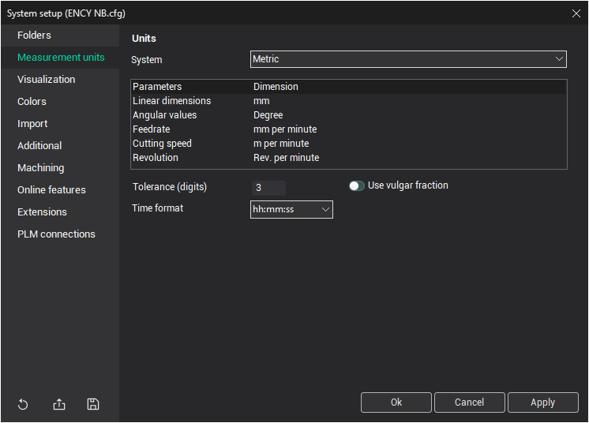

# Measurement units tab

The <strong>Measurement Units</strong> settings allow you to define the measurement units for the system.

Measurements are based on the units used in the imported model. The output data (NC) is created using the same units. Consequently, to generate an NC program for a CNC milling machine in millimeters (or inches), all measurements of the model must be in millimeters (or inches).

<strong>Angular measurements</strong> are given in degrees with decimals.

## Additional Settings:

- <strong>`Tolerance (digits)`</strong>: Defines the number of digits after the decimal separator for values output into the NC program. It is recommended to set this value at least one digit higher than the maximal NC machine tolerance (or digits count after the decimal separator in the NC program).
- <strong>Time format</strong>: Specifies the format for time output, such as for machining time.
- <strong>Use vulgar fraction</strong>: This option allows the system to use vulgar fractions where appropriate.
