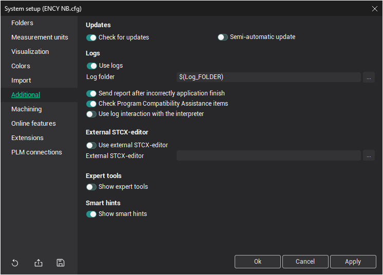
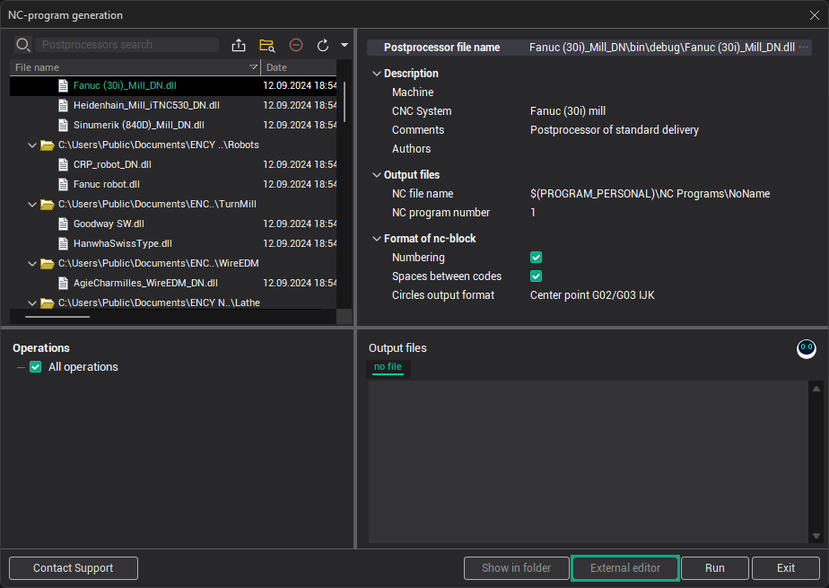
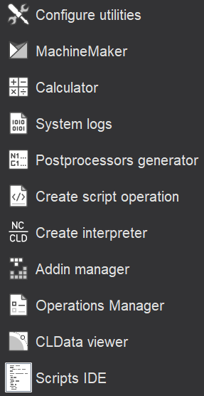
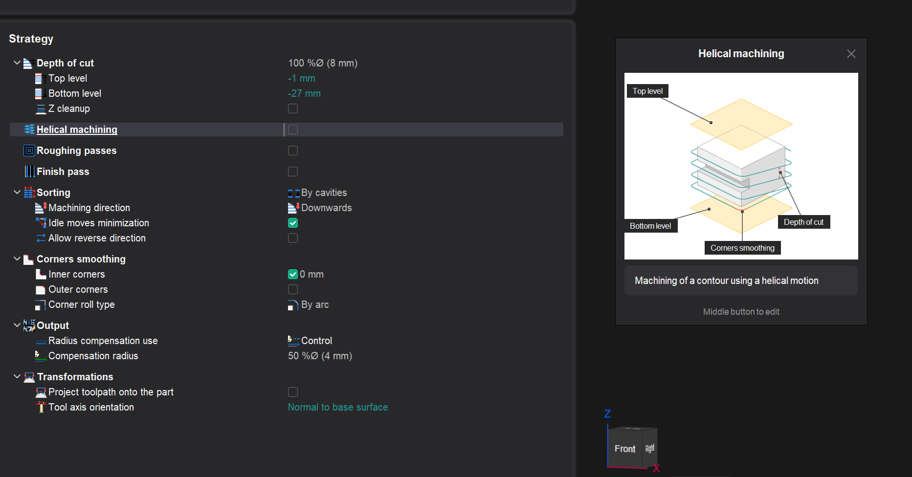

# Additional tab

To configure system event logging and update settings, use the <strong>Additional</strong> page.

Logs are useful when you encounter issues which are difficult to explain in words or which occur only when a specific consequence of actions is executed.

## Update Settings:

- To enable automatic update checks, switch on the <strong>Check for updates</strong> option.
- Enable <strong>`Semi-automatic update`</strong> to start downloading updates immediately after clicking the "Updates found" notification.

## Logging Settings:

- To enable logging, check the <strong>Use logs</strong> option. Logs are useful for diagnosing issues that are difficult to describe or that occur only during a specific sequence of actions.
- The <strong>Log folder</strong> field allows you to specify the location where the system will save log files.
- To automatically send error reports, check the <strong>Send report after incorrect application finish</strong> option.
- The <strong>Check Program Compatibility Assistance items</strong> option excludes the system from compatibility checks with other programs by the [Program Compatibility Assistant](https://msdn.microsoft.com/ru-ru/windows/compatibility/pca-scenarios-for-windows-8).
- To log the system's interaction with the interpreter (used in [Simulation of machining by NC program](10291.md) and [G-code based operations](10379.md)), enable the <strong>Use log interaction with the interpreter</strong> option.

## External Editor Settings:

The <strong>`External STCX-editor`</strong> panel affects the [NC-program generation](69.md) window and allows you to select an external editor to modify NC programs.

## Expert Tools:

The <strong>Show expert tools</strong> option makes advanced tools visible for expert users.

## Smart Hints:

The <strong>Show smart hints</strong> option toggles the visibility of smart hints in the interface.

