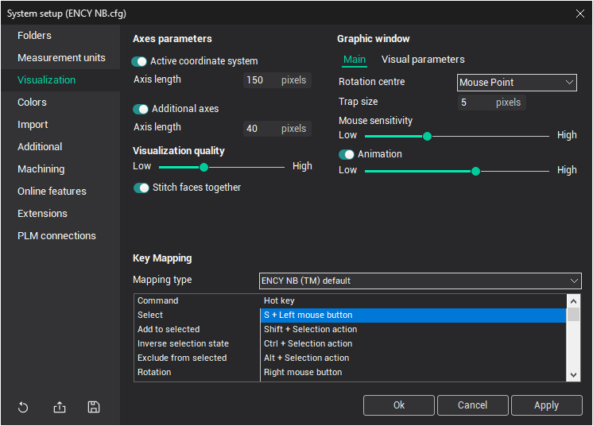

# Visualization tab

The [Graphical Window Settings](169.md) control the visualization and display parameters.

- <strong>Axes parameters</strong>: This panel allows you to adjust the visibility of coordinate systems and the length of their axes. The <strong>Active coordinate system</strong> is displayed in real space, while <strong>Additional axes</strong> are drawn on the left side of the graphical window.
- <strong>Visualization quality</strong>: You can set the default visual quality of objects on this panel. Moving the slider at the bottom will adjust the visual accuracy—the higher the quality, the more computer resources are required. This accuracy setting will apply to all newly imported objects. <em>Note: It is not recommended to set high accuracy on low-specification computers, as it may negatively affect performance.</em>
- **Stitch faces together**: When triangulating surfaces for visualization, this option ensures that surfaces are stitched together, avoiding gaps between them.

## Graphic Window Settings:

- **Main**
  - <strong>Rotation centre</strong>: Defines the center point of rotation for the graphical window.
  - <strong>`Trap size (px)`</strong>: Defines the trap size in pixels for selecting and highlighting objects.
  - <strong>Mouse sensitivity</strong>: Controls the speed of rotation and scaling when using the mouse.
  - <strong>Animation</strong>: Specifies the number of intermediate frames when the view parameters of the graphical window change instantly.
  - <strong>Perspective</strong>: Determines the degree of perspective distortion applied to objects during visualization.
- <strong>Visual parameters</strong>:
  - <strong>Rendering mode</strong>: Offers three options:
  -
    1. <strong>Hardware Advanced</strong>: Shader-based rendering.
    2. <strong>Hardware Standard</strong>: Classic hardware-accelerated OpenGL rendering without shaders.
    3. <strong>`Software (very slow)`</strong>: Software-based rendering with OpenGL, not utilizing the video card.
  - <strong>Ambient occlusion</strong>: Enables object shading for added depth and realism.
- <strong>Key Mapping</strong>: Defines hotkeys for visualization control. The CAM system offers four different key mapping schemes, designed for users familiar with other systems. On this panel, you can select the key mapping scheme, but hotkeys themselves are read-only.
