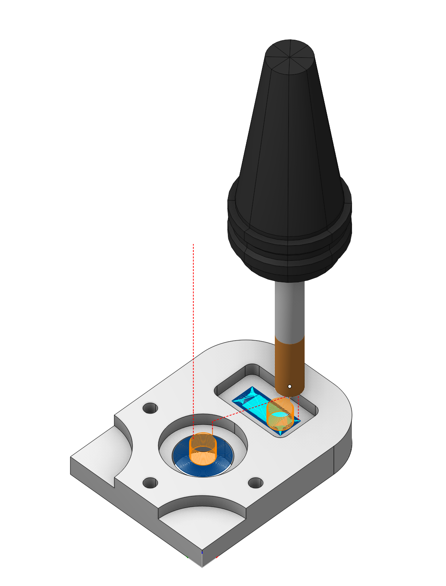
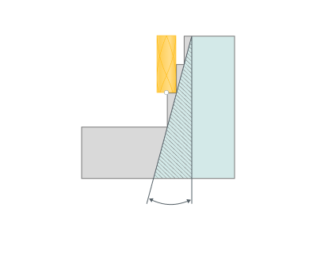
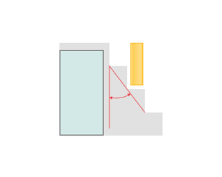

# Pocketing

## Application area:

The pocketing operation is used for 2/2.5D machining of pockets and islands, and also for preliminary material removal before engraving operations. As in the engraving operation, the model being machined is formed from a projection of curves onto the horizontal (XY) plane. The model is created by successive addition of curves or curve groups into the resulting area.

### Setup:

The <strong>Setup</strong> tab is used to configure the primary parameters of the project. This can involve the positioning of the part on the equipment, the coordinate system of the part, and more. [Details](1022.md)

### Job assignment:

<strong>Base surface.</strong> This surface serves the purpose of projecting a trajectory onto it. [Details](10156.md)

<strong>Add Boss.</strong> Allows you to add a boss. [Details](806.md)

<strong>Add Pocket.</strong> Allows you to add a pocket. [Details](806.md)

<strong>Add Inversion.</strong> Indicates a closed area, inside which the machining rules will be reversed, i.e. machined areas will become unmachined and vice versa. [Details](806.md)

<strong>Top Level.</strong> Specifying the top level by model elements. [Details](10153.md)

<strong>Bottom Level.</strong> Specifying the bottom level by model elements. [Details](10153.md)

<strong>Properties.</strong> Displays the properties of an element. It is possible to add the stock. You can also call this menu by double clicking on an item in the list.

<strong>Delete.</strong> Removes an item from the list.

<strong>Restrictions.</strong> It allows you to restrict areas that should not be machined. [Details](101231.md)

### Strategy:

#### Machining strategy:

This parameter allows the user to achieve a toolpath that appears parallel or equidistant or other when performing pocketing operations. This parameter group works similarly to the <strong>Waterline roughing operation.</strong> [Details](736.md)

#### Machining levels:

It defines the range along tool axis for the machining. This parameter group works similarly to the <strong>Waterline roughing operation.</strong> [Details](736.md)

#### Depth Step:

Material removed in one pass along the tool axis between the <strong>Top</strong> and <strong>Bottom</strong> levels.

Click here to expand..

<strong>Side angle.</strong> This refers to the inclined surface of the component (such as a casting slope), and creates a clearance from the vertex.

When the <strong>Side angle</strong> parameter is set to 0, the resulting machined feature is a simple extrusion. The profile of this extrusion is defined by the geometry sketched or selected at the top machining level (Z‑plane).

If the <strong>Side angle</strong> is set to a value greater than 0 (but less than 90), the CAM system automatically generates a tapered side wall. This creates a 3D feature where the sides are inclined relative to the vertical axis (Z‑axis), with the angle of inclination precisely matching the specified lateral angle.

<strong>Relief angle.</strong> Inputting a positive value avoids the tool shank 'rubbing' as the machining depth increases.

When machining deep vertical walls, it is sometimes needed to restrict tool contact with the already machined part. For this purpose, in the operations that perform machining by layers, it is possible to assign a relief angle. When machining a vertical (or close to vertical) surface, the real stock will increase at machining layer as shown in the picture (below). The relief angle is allowed for all walls that are close to vertical, i.e. not only close for the model being machined, but also the restricting ones.

The relief angle value cannot be negative, nor can it be more than or equal to 90 degrees. Setting the relief angle too high will lead to a large layer of unmachined material at the lower layers.

#### Milling type:

Сan be assigned in almost all operations, except for the curve machining operations. This allows the user to control the required milling type (climb or conventional) during the toolpath calculation process. This parameter group works similarly to the <strong>Waterline roughing operation.</strong> [Details](736.md)

#### Sorting.

Controls the sequence of toolpath passes during the surface machining. This parameter group works similarly to the <strong>Waterline roughing operation.</strong> [Details](736.md)

#### Corners smoothing.

When there is a sudden change of the tool direction, the milling control performs deceleration before starting the turn, and then accelerates again. This fact can lead to vibrations and high tool and milling machine wear. The problem can be solved if the toolpath has very few or no breaks. For this reason, in the system there is the toolpath smoothing function using the defined radius for machining inner or outer corners of the model. This parameter group works similarly to the <strong>2D contouring.</strong> [Details](404.md)

#### Tool contact point.

Tool Contact Point (TCP) is a specific location on a cutting tool that defines the primary interaction point between the tool and the workpiece surface or geometric entities during machining operations.

The parameters of this group are the same as in the <strong>5D Surfacing operation</strong>. [Details.](10135.md)

#### Transformations.

A dialogue for transforming the toolpath. This parameter group works similarly to the <strong>2D contouring.</strong> [Details](404.md)

### Parameters:

This tab contains the main parameters for controlling the part, workpiece, fixture and other items, which allow you to change the trajectory. [Details](100112.md)

### Links/Leads:

In the Links/Leads tab, you define the parameters for rapid movements. These movements include tool approach from the tool change position, engage to the start of the working stroke, retraction after the final cutting motion, transitions between working passes, and return to the tool change point. You can configure the sequence of movements along the coordinates, the trajectory of these motions, and the magnitude of displacements.

Click here to expand..

<strong>Сonsists of:</strong>

<strong>Approach/Return.</strong> This group of parameters manages the tool movements from the tool change position to the start of the engage toolpathes, and back. [Details](100116.md).

<strong>Safe motions.</strong> Defines the type of Safety Surface and the distance from the workpiece to it. This surface facilitates transitions between the processed surfaces or tool paths, and the first stage of approach or return occurs toward it. [Details](100117.md).

<strong>Advanced links settings.</strong> This group of parameters specifies the features of trajectory formation for primarily five-axis operations, considering optimal movements of rotational axes. [Details](100118.md).

<strong>Links.</strong> Defines the rules governing Entry/Exit links and links between work moves. [Details](100120.md).

<strong>Distances.</strong> Distances required to switch feeds [Details](100139.md).

<strong>Allow plunges.</strong> Enabling plunges allows machining of closed pockets. When CAM software encounters a closed pocket that can not be machined from the outside, it forms a Plunge move. [Details](744.md).

### Feeds/Speeds:

Using this dialogue the user can define the spindle rotation speed; the rapid feed value and the feed values for different areas of the toolpath. Spindle rotation speed can be defined as either the rotations per minute or the cutting speed. The defining value will be underlined. The second value will be recalculated relative to the defining value, with regard to the tool diameter. [Details](100142.md)

### Holes (Drill points)

1. Drill points — including coordinates, depth, and tool diameter — are stored in an editable unified list and serve as approach points when external access is not possible. [Details](125146.md)

### Transformations:

Parameter's kit of operation, which allow to execute converting of coordinates for calculated within operation the trajectory of the tool. [Details](10168.md)

### Part:

A Part is a group of geometrical elements that defines the space to check for gouges. [Details](330.md)

### Workpiece:

A workpiece model of an operation defines the material to be machined. [Details](738.md)

### Fixtures:

As the Fixtures the fixing aids such as chucks, grips, clamps, etc., and the restriction areas of any other nature are usually specified. [Details](10283.md)
