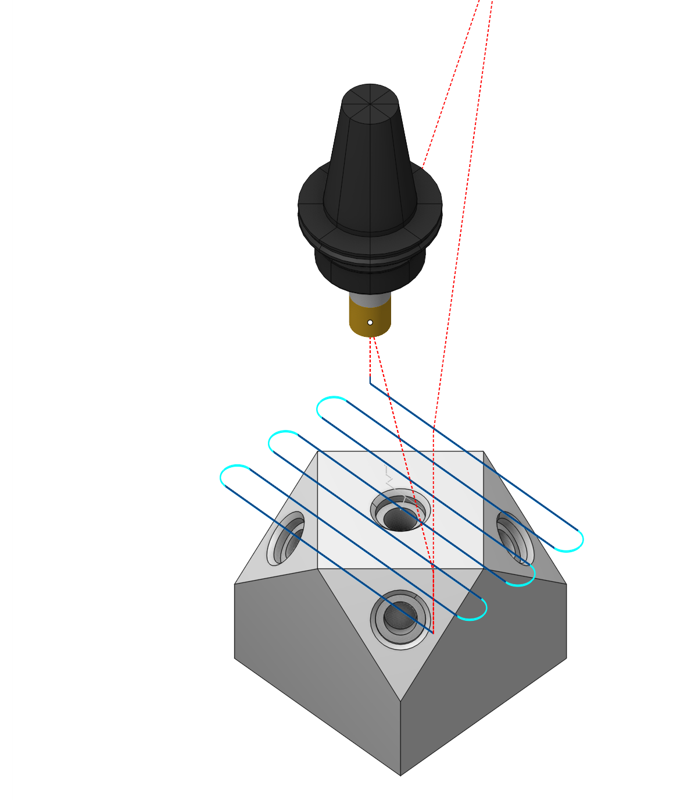

# Tool orientation

 

## Application area:

5-axis positioning provides a convenient method of manufacturing parts that require milling on multiple faces by minimizing setups. 5-axis positioning is performed by setting the appropriate values to the <strong>Tool orientation</strong> parameter section in the operation Setup panel. All the milling operations may be used for part's processing from different sides. In the case the equipment doesn't allow to rotate the part or the axis of the tool, it is necessary to change the [scheme of part's workholding](10066.md). In CAM system you can easily set the rotary axes position <strong>by clicking on the part face</strong> which the tool axis has to be aligned to

## Principles of working with a window.

For a particular operation you can set the actual values for the rotary axes position as you need. After generating toolpath the Approach section of the CLData will contain the commands of rotary axes positioning. The entire program is then generated with regard to the new rotary axes position.

### Tool orientation window.

<strong>Up, Down, Front, Back, Left, Right.</strong> If you want to specify one of the standard orthogonal orientations, you can use the buttons with names corresponding to the direction you need

<strong>View vector.</strong> You can also orient the machine axis along the current view vector used in the graphics window

<strong>X,Y, Z</strong>. Determine the rotation vector

Flank. Option will help you orient the tool sideways in relation to the selected direction instead of along it.

Rotation angle. Additional turning angle.

Alternate solution. Option if the machine allows you to provide the same relative position of the tool relative to the workpiece in several ways.

You can easily set the rotary axes position by clicking on the part face.

By default an operation generates the toolpath in the [Workpiece coordinate system (G54 - G59)](10068.md), but you can change this behavior by specifying the [Operation local coordinate system](726.md) parameter in the Setup panel.

Many today controls require definition of the local coordinate system for 5 axis positioning. Without this definition the position of the workpiece zero point (G54) and the position of the tooling point is not updated after changing the position of rotary axes - the control behaves as it knows nothing about the machine kinematics - as a regular 3 axis control. But when you specify the local coordinate system (the PLANE function at HDH, the ROT function at Sinumeric), the control updates the position of the workpiece zero and the position of the tool tip regarding to the actual workpiece-tool orientation. It looks like at the following figures.

When changing the orientation of a tool, it is most often necessary to set a local coordinate system so that the machine can compensate for the position of the workpiece coordinate system and the tool's setup point. [Details](726.md)

.png)

Starting position of the machine tool (A0 C0). G54 is located at the upper left corner of the workpiece, the tool setting point is aligned with the tip.

.png)

Machine position after five-axis positioning without specifying a coordinate system (A20 C-40). The workpiece zero and the tool set point have not changed their position in space, while the workpiece and tool have. The calculated trajectory will depend on the position of the workpiece on the machine and the tool reach.

.png)

Machine position after five-axis positioning with coordinate system reference (A20 C-40). G54 is again at the upper left corner of the workpiece and the tool set point is again aligned with the tool tip. The calculated control program will be independent of the workpiece position on the machine and the tool reach.

For this reason, in most cases, it is recommended to set the Local SC parameter to Auto for racks equipped with the coordinate system rotation function. For more information, refer to the [Local coordinate system](10068.md) section of this manual.
