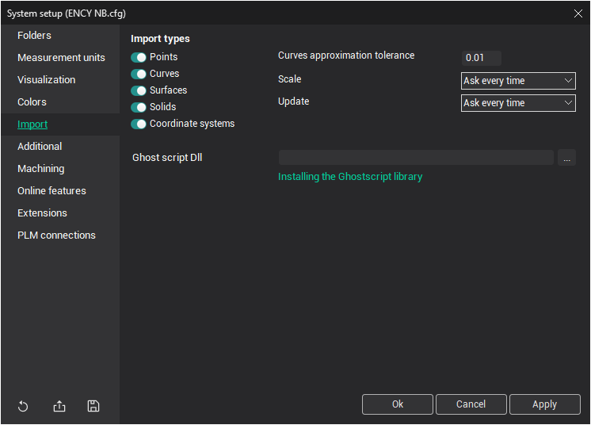

# Import tab

In this section, you can set the general [import](109.md) parameters.

- In the <strong>Import types</strong> objects group, the user can define the [types of geometrical objects](283.md) that can be imported from CAD files. If the box next to a specific type is not selected, the corresponding object will be ignored during the import process.
- If a curve needs to be transformed during import, approximation will be performed using the value specified in the <strong>Curves approximation tolerance</strong> field.
- The <strong>Scale</strong> option is used to control the appearance of imported objects.
- **Ghost script dll** is used for importing [PostScript files](268.md).
