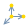
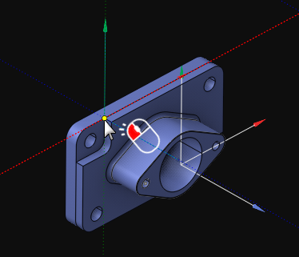
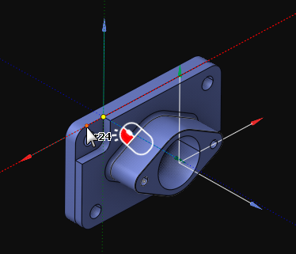
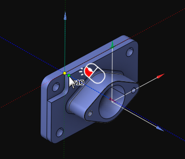
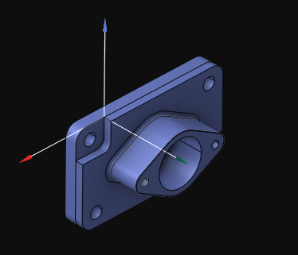

# Creation of the coordinate system by the origin point and two leading vectors

Creating a new coordinate system in this way is activated by pressing the  menu item on the [coordinate systems panel](753.md).

The new coordinate system is defined by the origin point and two leading vectors, X and Y. The zero point must be assigned by moving the cursor in the [graphic window](169.md) to the desired point. If it is a valid point to be used as the origin of the coordinate system, it will be highlighted. The selection is confirmed by left-clicking on it:

After that, the direction of the X-axis must be specified by choosing a point on the screen through which the X-axis will pass and left-clicking the mouse:

Then, the process is repeated for the Y-axis:

Afterward, the newly created coordinate system becomes active:

At any time, the name of the coordinate system, its color, and its origin point can be [changed](403.md).
