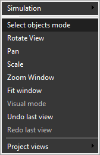

# The selection of the CL-data commands from the graphical view

All CLDATA commands can be divided in two groups: the commands that move the tool and commands that do not. To the first group belong commands like **GOTO**, **CIRCLE**, **MULTIGOTO**, **MULTIARC**, **PHYSICGOTO**, **GOHOME**. These and other motion commands define the tool toolpath curve.

If a tool path is visible (the  button on the [visibility panel](359.md) is checked), then the active (i.e. selected) tree node with all its sub nodes is displayed in the view. Activating another node in the tree changes the view to display the appropriate toolpath fragment.

One can walk through the tree directly in the graphical view.

Enable the "Select objects mode" option in drop-down menu of the view port before the selection of the required tool path fragment.

The fragments inside or the selected node is highlighted then the mouse is moved. It is necessary to click the left mouse button on the highlighted object to select it. The tool path outside of the selected node is shown transparently and cannot be selected. To move to the parent of the selected node one can simply double click in the view.
