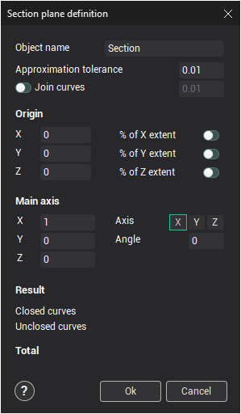

# Intersect

A section is a parametrical element of the geometrical model. The section object is added into a folder of the geometrical tree to automatically receive intersection curves of all faces and meshes from the folder with the defined section plane.

Press the  button in the **Model** mode to create the section object for the active folder. After that the section plane definition mode will be activated and the plane parameters window will be shown.

The section plane is defined by the origin point, main axis direction and rotation angle around the axis.

Coordinates of the origin point can be defined on the **Origin** panel by absolute coordinates or in percentage of overall dimensions of the intersected model. The associated fields must be checked for the second case.

The origin point can be defined interactively in the [graphical window](169.md). To do that it is necessary to click once by the left mouse button on the small box of the origin point and to move it into a new place. Click once more on the same mouse button to fix the origin point there.

The main axis direction can be defined by the second point coordinates on fields of the **Main axis** panel or by axis choosing on the same panel. The main axis direction can be defined interactively too. The interactive method likes to the origin point definition.

The angle value of rotation around the main axis is defined on the **Main axis** panel or interactively. It is possible to drag the section plane into a new position by one of axes or by any point of the plane.

The **Result** panel shows count of the intersection curves for the current parameters. The curves are calculated with the **Approximation tolerance** value. If the **Join curves** option is checked then the system tries to join all result curves with defined tolerance.

The designed section represents as a group of curves. The curves can be modified, copied into another folder or deleted. However the curves will be regenerated when an object from the associated folder is changed.

The section parameters can be edited. It is necessary to select the section and choose the **Modify Plane** item in the popup menu of the **Model** mode.
