# Cutting conditions of lathe operations

The feed rates and spindle speed of the current lathe operation are defined on the federates page of parameters window. The is shown below:

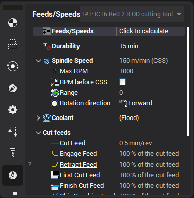

<strong>Speed</strong>

There are two ways to define the spindle rotation speed: Directly rotations per minutes **RPM** and with constant surface speed **CSS**. In the first way the rotations speed is constant. In the second way the NC control calculates the rotations speed depends on the current machining diameter. In this case the maximum spindle speed restricts the **RPM**. It is also possible to call [calculator](100142.md) for speeds and feeds.

<strong>RPM before CSS</strong>

If the tool is located in the tool change position and spindle is enabled in CSS mode then spindle has slow rotations because the tool is too far from the workpiece axis. At the first rapid motion the spindle has huge acceleration because the tool goes to the axis. It is not good for the machine. To resolve this problem some machine builders recommends enable spindle in RPM mode and switch it to the CSS mode in the point with the work feed. So "RPM before CSS" enable the spindle in RPM mode on the rotations that must be equal to the RPM in the first work point. And after approach it switch to CSS mode.

<strong>Range</strong>

Range is the speeds range specific to the machine (with mechanical gear box).

Feed

It is possible to set the feed for the different tool path segments. Depends on the operation type the tool path can contains the different segments, so the count of the feeds is changed.

All feed types are listed in the table below:

|   |   |
|---|---|
| 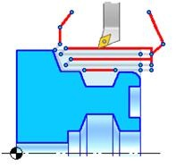 | All auxiliary feed All feeds where the shaving is not performed. Used to move the tool in work path start. |
|   |   |
| 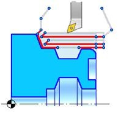 | All work feeds All feeds where shaving is performed. |
|   |   |
| 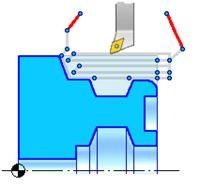 | Rapid feed Used when moving throw the safe planes. The tool path segments that have the rapid feed are shown as red. To switch to the rapid feed the RAPID command of CLData is used. |
|   |   |
| 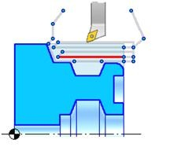 | Cut feed Defines the feed of the work motion. It is the main feed. All other feeds can be defined as a percent of the cut feed. |
|   |   |
| 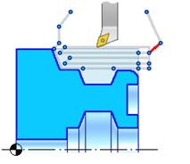 | Approach feed Defines the feed for the tool engage in the cutting zone to the start point of the first approach from the Start point. |
|   |   |
| 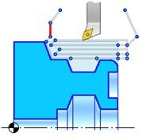 | Return feed Defines the feed for the tool return from the last point of the last path to the Finish point. |
|   |   |
| 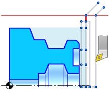 | Engage feed Defines the feed that is used in the engage to the first point of the work path. It is equal to the work feed as default. |
|   |   |
| 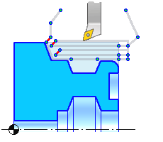 | Retract feed Defines the feed that is used on the retraction from the surface after the work stroke. It is equal to the work feed as default. |
|   |   |
| 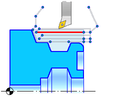 | First cut feed Defines the feed that is used to remove the first layer from the workpiece. If the workpiece has the crust then the first feed must be less than the cut feed. |
|   |   |
| 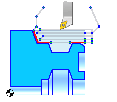 | Finish cut feed In the rough operations defines the feed of the motion along the machining surface to get the required roughness. |
|   |   |
| 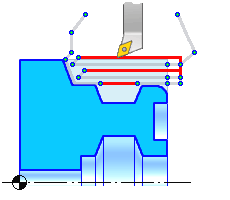 | Traversal feed Defines the feed that is used to make the motion to the next work pass. |

The feeds values can be defined in the defined in:

- `mm/min` – defines the feed value as a motion length per minute
- `mm/rev` – defines the feed value as the tool motion length per one spindle rotation;
- `in % of the cut feed` – defines the feed in the percent of the cut feed value. For instance if the value is 100% then the feed is equal to the cut feed. If the value is 50% then the feed is equal to the half of the cut feed.

<em>Note: If the cut feed is changed than the all feeds defined as a percent of the cut feed will be modified.</em>
