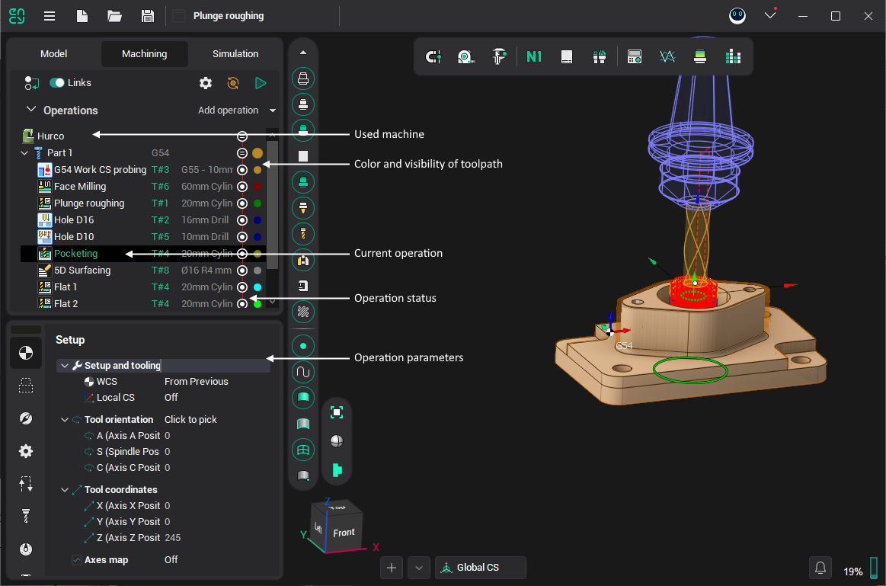
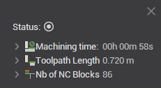
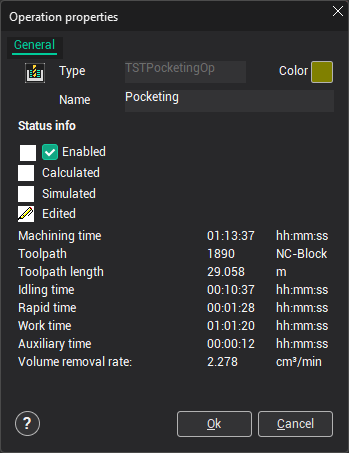

# Defining machining sequence

Before defining a machining sequence one should specify the produced part, the stock and the fixtures for the sequence. That is, one should define what is produced at first (the part), than what from it is produced (the workpiece) and only than how it is to be produced (the machining sequence).

The specified **Part** will be checked by all subsequently created operations irrespective to an operation machines the whole part or only some piece of it.

The **Workpiece** model should be necessary specified except of cases when the part is machined only with finishing operations without taking the initial and intermediate work pieces into account. The workpiece model needs to be a solid, i.e. represent a bounded space. The faces composing a workpiece are either to be sewed using prescribed tolerance or to close to the specified level. The workpiece also can be defined using solids generated on curves as well as swept around the part (e.g. box, cylinder around part). The workpiece defines the initial stock being modified by machining operations. That is, the workpiece of an operation is the machining result of the preceding operation. As result, editing some operation changes input data for all subsequent operations and involves its resetting. The workpiece of the machining sequence is also used in the **Simulation** mode as initial stock.

The **Fixtures** define the initial restrictions to be not machined. If no operation overrides the fixtures, these affect all the operations.

The **Machining Result** is the stuff leaved after machining of the workpiece by series of operations. The node is introduced to offer a visual check for the rest material as well as for transparence of the workpiece transmission over operations. The item is calculated automatically and its contents can not be edited. If the toolpath of operation is not yet generated then the machining result of such an operation is the same as its workpiece.

In the technology mode the top part of the window contains the structured sequence of machining operations as well as the nodes for easy access to the operations' main parameters. The bottom part contains the parameters of the selected node.

- **New** – opens the dialog to create a new operation. If the current operation is a group then the new operation will be created inside the current group. Else, the new operation is inserted after the selected ones.
- **Parameters** – opens the dialog to edit the parameters values of the current operation: tool, federate, approach-retract, strategy.
- **Run** – runs the tool path calculation process for the current operation. If the current operation is, a group then all operations inside will be calculated.
- **Reset** – resets the tool path of the current operation. If the current operation is a group then the tool path of all operations in the group will be deleted.

Current operation can be deleted, renamed, copied or cut to the clipboard by the standard keys or from the pop-up menu:

- [Del] – deletes the current operation;
- [Ctrl+R] – renames the current operation;
- [Ctrl+X] – cuts the current operation to the clipboard;
- [Ctrl+C] – copies the current operation to the clipboard;
- [Ctrl+V] – inserts the operation from the clipboard. Operation is added to the end of the current group.

Mouse can change the structure of the job tree. To do it press and hold the left mouse button on the required operation and move it to the required place.

There is the icon near the every operation. This icon shows the operation status. [Details](1118119.md)

Detailed information about operation with the operation status is displayed in the property window. To open it click the right mouse button on the operation and select the "Properties:" item from the context menu.

The window shows the operation type and the icon corresponding to the type, operation name, tool path color. If the operation is calculated then the number of the commands in tool path and the machining time is shown. If the operation is simulated then idle, work, rapid and auxiliary time is shown. If the errors were detected, while the simulation then the information about error is shown.
