# Defining part, workpiece and fixtures

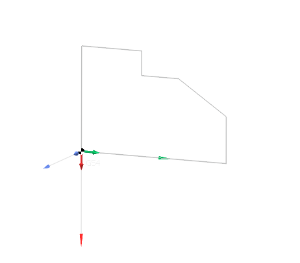 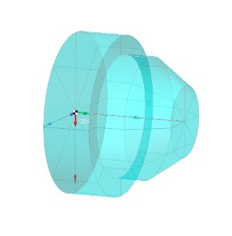

## Application area:

These elements allow you to specify a [part](330.md), [workpiece](738.md), [restrictions](101231.md) and [fixture](10283.md).

Each item of the list defines a surface, a solid etc to take into account while calculating toolpath. The item caption displays the full path to the item in the geometry model tree. If the source object of an item is removed or renamed the item is marked with the question sign. The icon left to the item defines either the item type or the way the item was achieved from the source object. To add an item of some type to the list the appropriate buttons are used.

<strong>Face.</strong> The button adds selected faces to the list. If no faces are selected then the dialog with the geometry model tree appears.

Click here to expand..

In this dialog one should find and select the faces, the meshes and the groups to be added to the list. If a group is added then only 3D-objects of the group will be taken into account. When defining a workpiece the **Add Faces** button is used to make a **solid** from the selected faces. The solid item represents a bounded space. It is marked with the  icon.

There are two possible ways to make a solid:

- By sewing faces. The added faces need to form one or more solids. The tolerance that the faces are connected with to each other is specified in the dialog that appears.
- By closing faces to the given Z level.

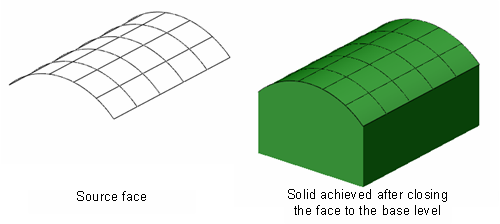

<strong>Primitive.</strong> Allows you to use different templates to define a workpiece in the form of primitives.

Click here to expand..

<strong>Workpiece of thr previous operation.</strong> The special link items are introduced. Those are used to provide relations between operations as well as to define simple parametric features. At that, a link item is the reference to the source object, that in turn can be a reference to another object. Changing a source object forces all link items to be reset and/or recalculated.

<strong>Machining result of the previous operation.</strong> The special link items are introduced. Those are used to provide relations between operations as well as to define simple parametric features. At that, a link item is the reference to the source object, that in turn can be a reference to another object. Changing a source object forces all link items to be reset and/or recalculated.

<strong>Restrictions of the previous operation.</strong> Allows you to set a primitive from the previous element (operations, setup stages, parts).

<strong>Empty workpiece.</strong> Allows you to specify a blank. Often used in painting.

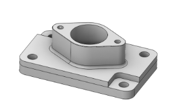

<strong>Box.</strong> Allows you to set a simple prism around a part.

Click here to expand..

<strong>Definition method.</strong>

<strong>Around part.</strong> Allows you to set a box around the part with the required stocks. The allowance is measured from the dimensions of the part.

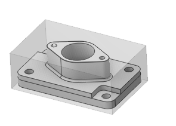

<strong>Around geometrical model.</strong> The allowance is added from the selected geometry (parts, surfaces).

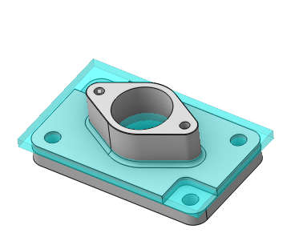

<strong>From center point.</strong> Allows you to specify a workpiece by points.The distance of the workpiece is determined from the central point (Pc) to the overall dimensions of the part.

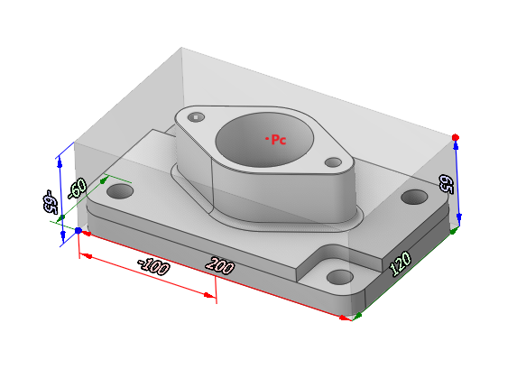

<strong>From bottom southwest point.</strong> Allows you to specify a workpiece by points. The distance of the workpiece is determined from the bottom point (P) to the overall dimensions of the part.

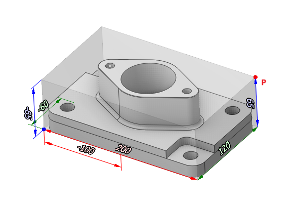

<strong>From two points.</strong> Allows you to specify a workpiece by points. The distance is measured between point P1 and P2. In this case, the points in the window are specified along three axes (X,Y,Z) relative to the global coordinate system.

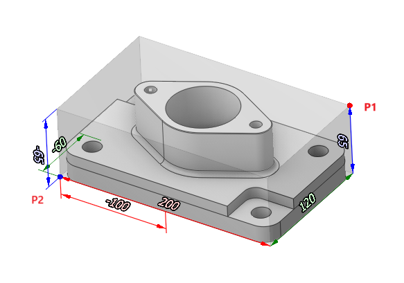

<strong>Cylinder.</strong> Allows you to define a cylinder around a part as a workpiece.

Click here to expand..

<strong>Around part.</strong> Builds a cylinder based on the dimensions of the part around the global axis of the coordinate system (if selected <strong>Сenter of Box</strong>).

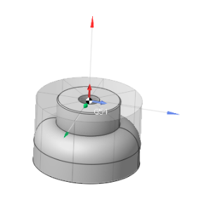

<strong>Around geometrical model.</strong> Builds a cylinder based on the selected element (face,part) around the global axis of the coordinate system (if selected <strong>Сenter of Box</strong>).

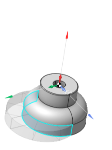

if selected <strong>Сenter of CS</strong> then the workpiece is built in the same way, only around the selected SC.

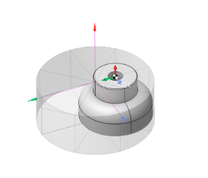

<strong>From center point.</strong> Allows you to specify a workpiece by points.The distance of the workpiece is determined from the central point (Pc) to the overall dimensions of the part.

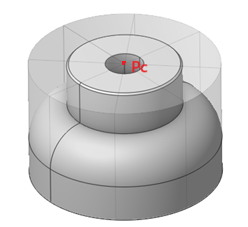

<strong>Tube</strong>. Allows you to define a cylinder around a part with a hole in the center as a workpiece. Works similar to a cylinder.

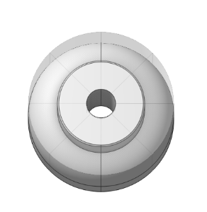

<strong>Turn Envelope.</strong> Allows you to rotate the workpiece around the part.

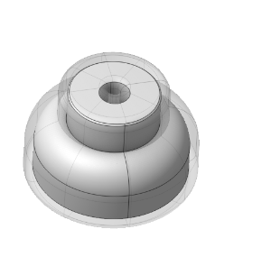

<strong>Castling.</strong> Allows you to set the casting with an equal offset of the workpiece from the surface of the part

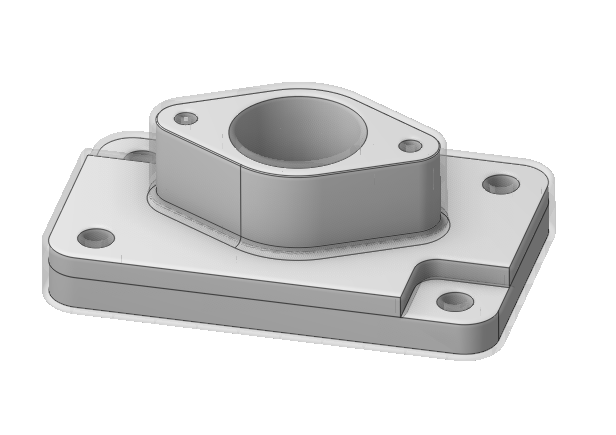

<strong>Polygonal prism.</strong> Allows you to set the workpiece as a polygon from the center of the workpiece (Pc).

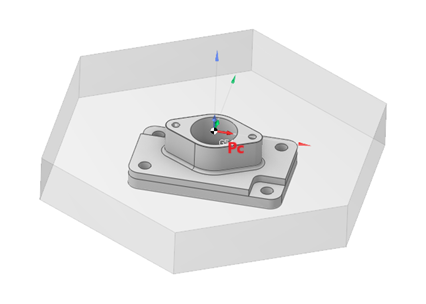

<strong>Turn.</strong> The turn button makes a revolution solid generated from the specified curves. If no curve is selected the dialog that helps find and select the generating curves for the solid appears.

Click here to expand..

 

<strong>Extrude.</strong> The extrude is used to make a prism.

Click here to expand..

Closed curves as well as group of curves forming closed profiles can be used as the source objects. The specified curves are used as the base of the prism. In addition, the top and the bottom levels of the prism should be specified.

If one wants define a prism with holes and isles he needs place the source curves in one folder and specify that folder as the prism base. As a rule the outer curve defines the body and the inner curves define the holes. It is possible to set the outer curve as a hole for the fixtures. To do it is necessary to check the **Throw hole** box.

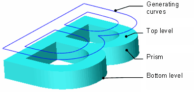

