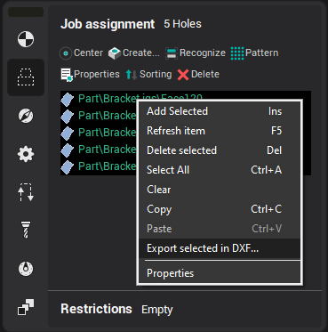

# Tips & Tricks in the roughing waterline and pocketing operation

In the [waterline roughing](736.md)waterline roughing and [pocketing](256.md) operation, the holes list defines the positions where vertical tool plunging is allowed because they are already drilled. The holes list is used for these operations by setting the plunge method to **Through drill point** in the toolpath window. If, when the toolpath is being calculated, the tool cannot approach an area from outside, then the system searches for an appropriate point in the holes list and if an appropriate hole is found, then it will be used for the vertical tool plunge. If a suitable hole isn't found, then one will be created automatically and added to the holes list.

For the fast creation of an operation that will provide preliminary drilling for tool plunging, it is necessary that when the [hole machining operation](10100.md) is being created, the user select the pocketing or waterline roughing operation as the prototype. By doing this, all of the holes of the prototype operation will be copied to the newly created operation. And vice verse, to use the holes obtained for tool plunging, the operation can be defined as a prototype for the waterline roughing or pocketing operations.

Select holes in the holes list and use the context menu **Export selected in DXF** item to export the list into the DXF-file.

