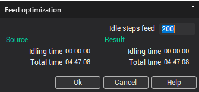

# Feed rates optimization

After the simulation, it is possible to change the feed rate of nodes that is marked as the idle node. Click right mouse button on the required operation and select the **Optimize feed** from the context menu. The next dialog is opened:

On the left hand, side of window the total machining time and the time idle motion is displayed. On the right hand side, the obtained with the defined feed rate value the total and idle time is displayed. After **OK** the new **FEDRATE** commands is inserted into the CLDATA sequence to change the feed rate before the idle motion.

<em>Note: In an operation does not have the idle motions then the optimization does not give any effect. If the idle steps feed value is smaller then the real feed value then the optimization does not have the sense because of the machining time increases.</em>
