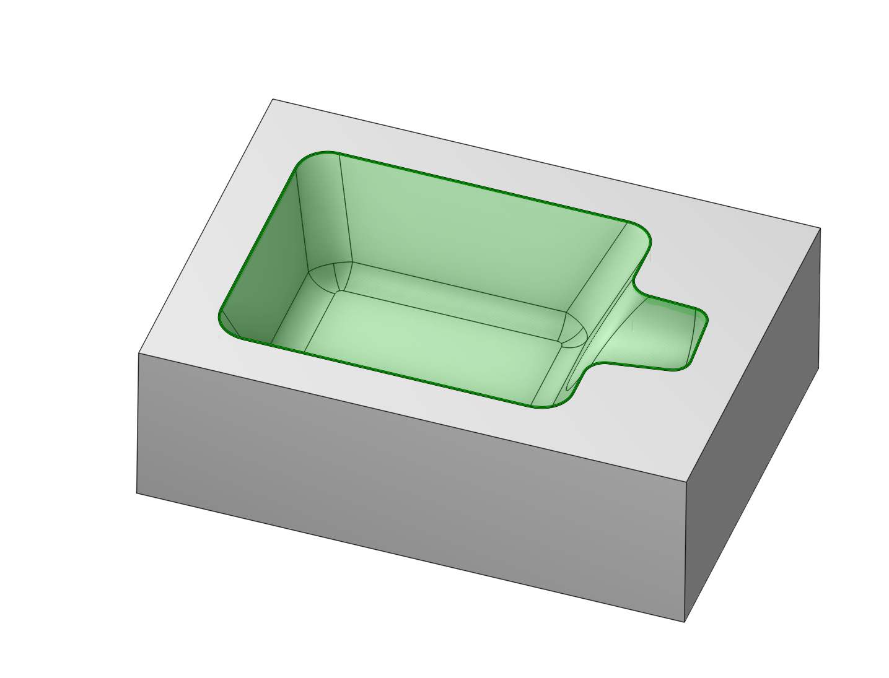

# Job assignment

## Application Area:

The job assignment specifies the surfaces and areas to be machined, depending on the operation type. Different methods can define the job assignment.

### Defining the job assignment

- For curve machining operations, such as 2D contouring and 3D curve milling, the assignment can be defined by curves, groups of curves, and points for circle centers. The toolpath considers user-defined options like tool offset and additional stock for curves.
- In engraving and pocketing operations, the assignment is based on top machining areas created from curve projections. The toolpath removes material outside the model, considering the stock and additional features like ridges and cavities defined by curves.
- Volume machining operations use solids, surfaces, and meshes for the job assignment. Additional stock can be specified for objects, influencing the toolpath to remove material outside the assignment without cutting the assigned objects.
- Turn operations offer various ways to specify fragments of the part's turn generatrix to be machined.
