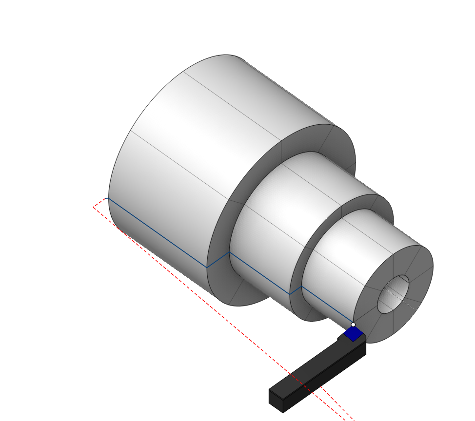
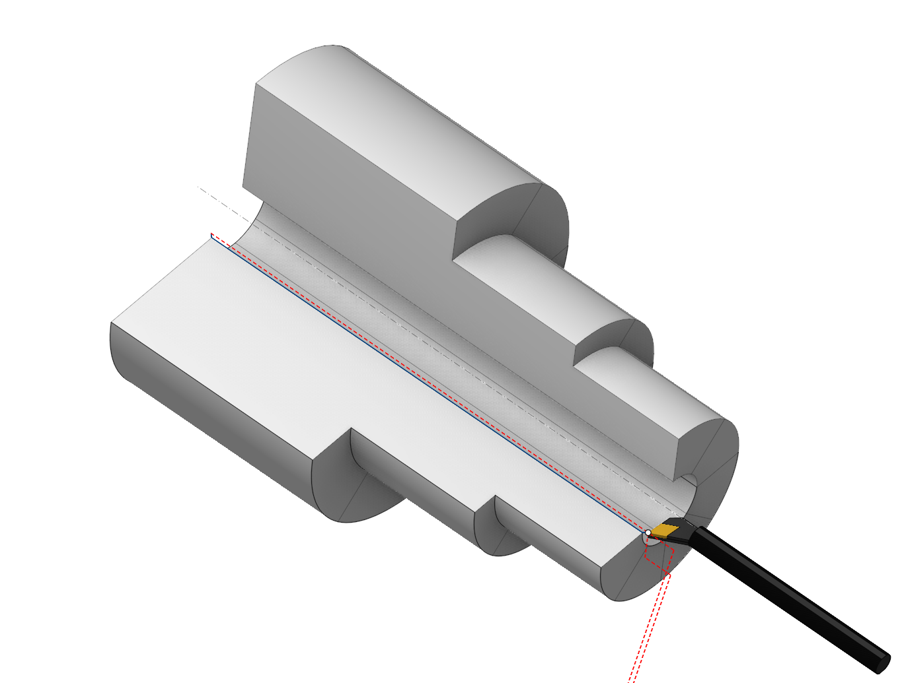

# OD Finishing and ID Finishing

 

## Application area:

The lathe finishing operations are designed for the removing of a small stock volume that is remained after the previous machining. The machining is performed by the series of the offset strokes to the part generatrix.

### Setup:

The <strong>Setup</strong> tab is used to configure the primary parameters of the project. This can involve the positioning of the part on the equipment, the coordinate system of the part, and more. [Details](1022.md)

### Job assignment:

<strong>Roughing.</strong> The roughing allowance is removed by tool movements along the axis of the workpiece (when processing surfaces elongated in the direction of the Z-axis) or perpendicular to it (when processing surfaces elongated in the direction of the X-axis). In other words, a trajectory is formed similar to ISO G71/G72, but it is output to the control program in an expanded form, without the use of a cycle. [Details](10192.md)

<strong>Roughing cycle.</strong> Similar to <strong>rough</strong> machining, but the operation is output to the control program in the form of a cycle, similar to ISO G71/G72. The roughing cycle allows the creation of one of the ISO G71 or ISO G72 cycles based on the specified contour of the workpiece. Switching between G71 and G72 is achieved by changing the <strong>Direction</strong> of tool movements (along the axis of the workpiece <strong>Axial</strong> or perpendicular to it <strong>Radial</strong>) in the parameters. [Details](10193.md)

<strong>Offset Roughing.</strong> The roughing allowance is removed by tool movements equidistant to the contour of the workpiece. In other words, a trajectory is formed similar to ISO G73, but it is output to the control program in an expanded form, without the use of a cycle. [Details](10190.md)

<strong>Offset cycle.</strong> Similar <strong>Offset Roughing</strong>, the operation is output to the control program in the form of a cycle, similar to ISO G73. [Details](10191.md)

<strong>Zigzag.</strong> This process is used for machining enclosed areas from both sides, using a neutral tool. The tool is engaged by plunging downwards and performs a horizontal movement to remove the next layer. The tool re-engages by plunging again and makes a horizontal pass in the opposite direction. This way, the entire roughing allowance is removed layer by layer through horizontal passes with alternating directions. [Details](10201.md)

<strong>Profile.</strong> This is the simplest type of cycle, where a single pass is generated, and its trajectory is identical to the specified initial geometric contour of the workpiece. Only minor modifications to the contour can be performed, including approach and retract linking, offsetting by specified allowances, excluding shaded areas that cannot be reached by the designated tool, and compensating for the tool radius. [Details](10189.md)

<strong>Facing.</strong> This allows programming the machining of the end face of a workpiece with a single command. The trajectory is formed in the same way as when specifying Contour or Contour Repeat cycles. However, the trajectory is automatically calculated based on the current blank and workpiece, ensuring correct machining of either the left or right end face. [Details](10194.md)

<strong>Properties.</strong> Displays the properties of an element. It is possible to add the stock. You can also call this menu by double clicking on an item in the list.

<strong>Delete.</strong> Removes an item from the list.

<strong>Restrictions.</strong> It allows you to restrict areas that should not be machined. [Details](101231.md)

### CycleParams:

This parameter group works similarly to the <strong>OD Roughing and ID Roughing operations.</strong> [Details](316.md)

### Feeds/Speeds:

Using this dialogue the user can define the spindle rotation speed; the rapid feed value and the feed values for different areas of the toolpath. Spindle rotation speed can be defined as either the rotations per minute or the cutting speed. The defining value will be underlined. The second value will be recalculated relative to the defining value, with regard to the tool diameter. [Details](100142.md)

### Transformations:

Parameter's kit of operation, which allow to execute converting of coordinates for calculated within operation the trajectory of the tool. [Details](10168.md)

### Part:

A Part is a group of geometrical elements that defines the space to check for gouges. [Details](330.md)

### Workpiece:

A workpiece model of an operation defines the material to be machined. [Details](738.md)

### Fixtures:

As the Fixtures the fixing aids such as chucks, grips, clamps, etc., and the restriction areas of any other nature are usually specified. [Details](10283.md)
