# OD Grooving, ID Grooving and Face grooving

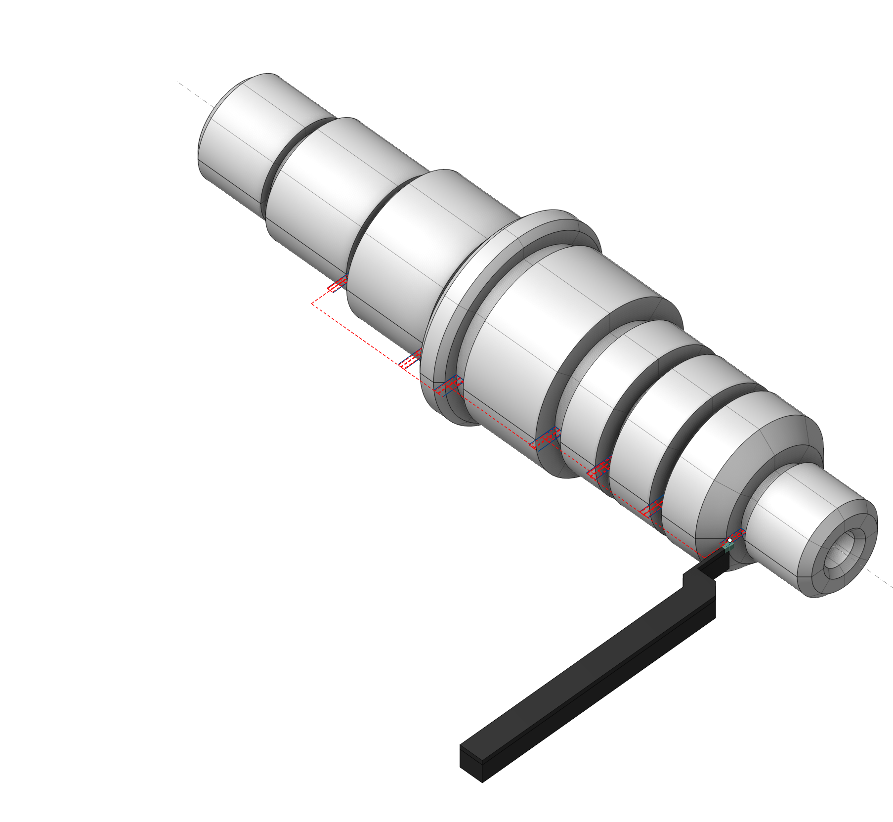

## Application area:

This operation turns grooves or closed areas that are inaccessible for processing by other types of turning operations. Rough machining consists of a sequence of passes perpendicular to the axis of the part. Finish passes are the movements that closely follow the contour of the part.

### Setup:

The <strong>Setup</strong> tab is used to configure the primary parameters of the project. This can involve the positioning of the part on the equipment, the coordinate system of the part, and more. [Details](1022.md)

### Job assignment:

<strong>Slotting.</strong> This cycle efficiently machines simple rectangular grooves with a minimum number of actions. [Details](10196.md)

<strong>Grooving</strong> <strong>.</strong> This cycle creates a complex toolpath for turning all types of grooves and undercuts. The cycle identifies the lowest point of the groove and processes both its sides with different cutting edges of the tool. [Details](10195.md)

<strong>Zigzag.</strong> The tool removes the rough stock layer by layer. In each layer, it plunges downwards to the cutting depth and performs horizontal movement. Thus, horizontal passes with alternating directions remove the entire rough stock, layer by layer. [Details](10201.md)

<strong>Profile.</strong> The system forms a single pass, the toolpath of which is identical to the geometric contour of the part. User can add engage/retract; shifting by stock values; tool unreachable gray zones excluding; tool radius compensating to the toolpath. [Details](10189.md)

<strong>Properties.</strong> Displays the properties of the selected element. You can additionally add allowance. You can call the Properties menu by double-clicking on the selected element.

<strong>Delete.</strong> Removes the selected item from the list.

<strong>Restrictions.</strong> It allows you to restrict areas that should not be machined. [Details](101231.md)

<strong>Cycle parameters:</strong>

#### Cycle:

You can select one of the available turning cycles described in the Job assignment. When you switch a cycle in this section, the corresponding element in the Job assignment automatically changes. The set of parameters varies for each turning cycle.

Click here to expand..

<strong>Machined Side.</strong> Specifies the sides of the groove to process. [Details](10195.md)

Click here to expand..

<strong>1st tool tip.</strong> The system forms the toolpath from the specified Rough passes direction to the side the tool can touch with its first setting point.

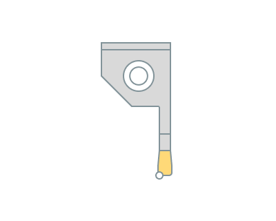

<strong><strong>2st tool tip</strong>.</strong> The system forms the toolpath from the specified Rough passes direction to the side the tool can touch with its second setting point.

<strong>Both tool tips</strong>. The system forms the toolpath to machine both sides of the groove.

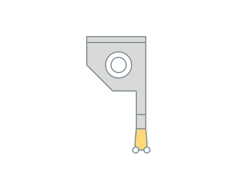

<strong>Tool path.</strong> This parameter allows choosing for which passes – <strong>roughing</strong>, <strong>finishing</strong>, or <strong>both</strong> – the system is generating the toolpath. [Details](10195.md)

Click here to expand..

<strong>Rough only.</strong> The system generates the toolpath only for rough machining. The parameters window shows only the parameters that affect this toolpath.

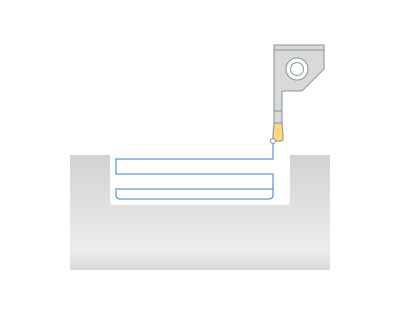

<strong>Finish only</strong>. The system generates the toolpath only for finish machining. The parameters window shows only the parameters that affect this toolpath.

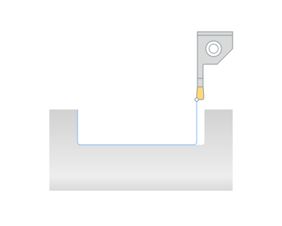

<strong>Rough and finish.</strong> The same tool first performs rough passes, then – finishing ones.

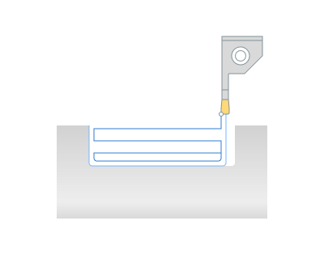

<strong>Rough passes direction</strong> <strong>.</strong> Specifies the direction in which the tool performs passes during rough machining of the groove.

Click here to expand..

<strong>From center.</strong> Rough passes start at the deepest part of the groove and move outward to the groove sides.

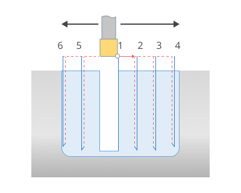

<strong>Forward.</strong> Rough passes proceed in one direction – from the starting point of the Job Assignment to the end.

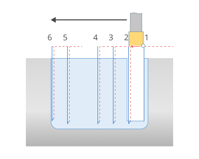

<strong>Rough step.</strong> The distance between tool passes is equal to the cutting depth.

Click here to expand..

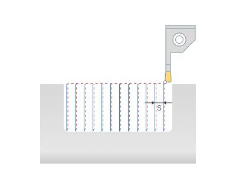

<strong>S -</strong> Rough step

<strong>Adjust step.</strong> When the flag is set, the system automatically adjusts the step for consistent cutting force on each plunge.

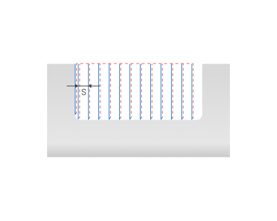 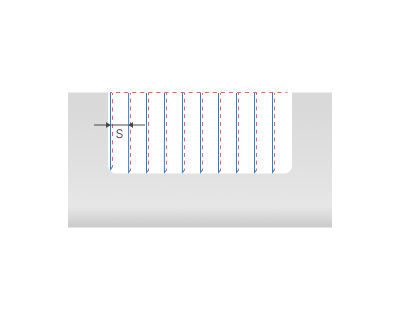

<strong>S -</strong> Rough step

<strong>Max step deviation.</strong> Defines the maximal deviation of the adjusted step from the defined step. This value can be defined in the length units or in the percents of the tool width.

<strong>Rough stock.</strong> This parameter leaves this allowance for subsequent machining. If the <strong>Finish pass</strong> flag is set, the system removes this allowance in the same operation.

Click here to expand..

<strong>Side stock.</strong> A stock of a specified size appears on faces. On conical and spherical surfaces, the allowance decreases in accordance with the angle of the surface normal. When setting both the radial and the axial stocks simultaneously, they combine quadratically on these surfaces.

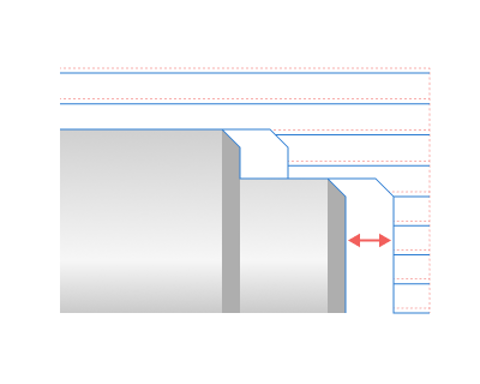

<strong>Bottom stock.</strong> A stock of a specified size appears on cylindrical surfaces. On conical and spherical surfaces, the allowance decreases in accordance with the angle of the surface normal. When setting both the radial and the axial stocks simultaneously, they combine quadratically on these surfaces.

<strong>Profile.</strong> The toolpath with this allowance passes equidistantly to the contour of the part by a specified amount. All allowances combine when you set them simultaneously.

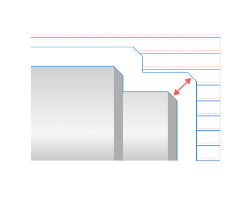

<strong>Finish pass direction.</strong> Determines the sequence of movements during the finishing pass.

Click here to expand..

<strong>To center</strong>. The tool passes from the periphery to the center during the finishing. It processes the sides of the surface to be machined using different strokes.

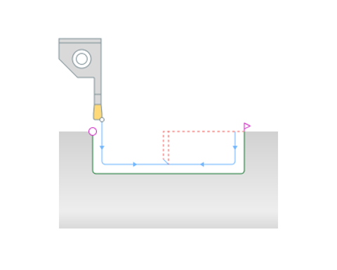

<strong>Forward</strong>. The tool processes finishing in one stroke, from the starting point of the Job assignment to the ending point.

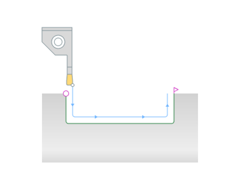

<strong>Backward</strong>. The tool processes finishing in one stroke, from the end of the Job assignment to the start point.

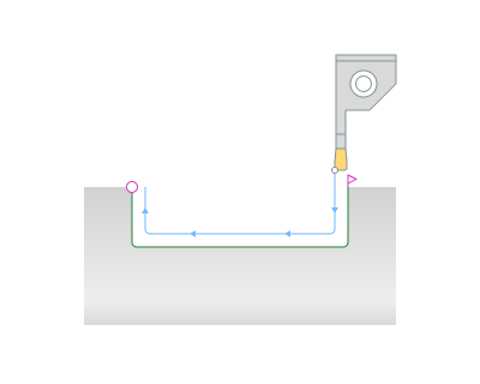

<strong>Canned cycle</strong>. This parameter determines the output of a groove canned cycle in the NC program.

Click here to expand..

<strong>Do not use</strong>. The toolpath does not format as an ISO G75 canned cycle in the NC program.

<strong>Use canned cycles</strong>. The tool path formats as an ISO G75 canned cycle in the NC program.

<strong>Separate 1st cut</strong>. The tool's first pass formats as a separate ISO G75 canned cycle, while subsequent passes format as a second separate ISO G75 canned cycle..

<strong>Separate every cut</strong>. Every tool pass formats as a separate ISO G75 canned cycle.

<strong>Multilayer.</strong> This technique facilitates the multi-layer removal of rough material. Upon flag activation, the tool makes cross passes to remove the first layer, then moves to the second layer, and continues accordingly.

Click here to expand..

<strong>Return Type</strong>. This specifies the elevation level for the tool during idle movements between layers in a single groove. The <strong>Safe Distance</strong> parameter sets this level.

<strong>Count.</strong> Specify directly the number of layers that split the groove's depth.

<strong>Overlap.</strong> The system performs a semi-finish cuts to remove the ridges remaining after the roughing passes. [Details](10195.md)

Click here to expand..

<strong>On</strong>. When the flag is set, the system performs a semi-finish pass to remove the ridges remaining after the roughing passes.

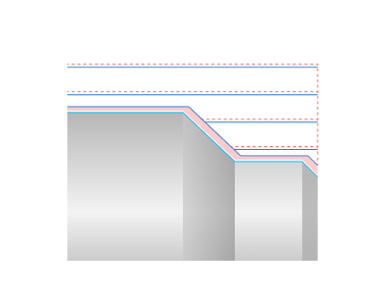

<strong>Off.</strong> The additional tool path is not generated

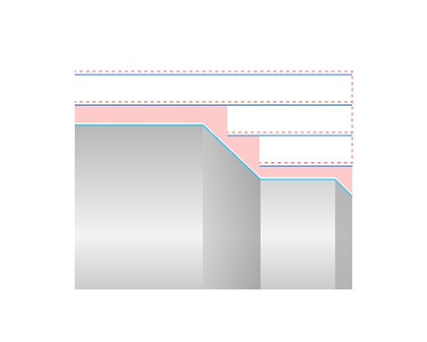

<strong>Auto.</strong> In Auto mode, the Overlap option is enabled when the Multilayer option is enabled.

<strong>Chip breaking.</strong> The system controls the mode of kinematic chip breaking in which, after a specified cutting length, the cutter retracts to stop the formation of continuous chip. Then the cutter engages again and continues cutting.

Click here to expand..

<strong>Off.</strong> The system has disabled the chip breaking mode.

<strong>On first plunge.</strong> The system activates the kinematic chip breaking mode only during the first rough pass of each machining layer.

<strong>Break count.</strong> Specify the number of cutter stops directly.

<strong>Return (% of Plunge).</strong> Specify the cutter's return distance after stopping for chip breaking as a percentage of the <strong>Step Depth</strong>.

<strong>On every plunge</strong>. The system activates the kinematic chip breaking mode for every rough pass.

<strong>Delay at the bottom</strong>. This feature controls feed stop at the bottom of the groove to create an even groove bottom. Activating this feature introduces a stop duration.

<strong>Back off</strong>. The system steers the cutter away from the processed surface when retracting after rough cuts, by pulling the tool aside, with the retraction distance measured perpendicularly to the direction of the cut.

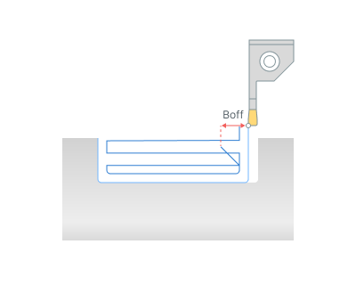

<strong>Safe distance</strong>. The distance from the top level of the groove to the level of rapid movements. You can edit the safety distance by dragging a point on the graphical screen or by directly input in the options window.

.png)

<strong>Check workpiece.</strong> When the flag is set, the system takes into account the current state of the workpiece. This significantly reduces machining time, especially if the shape of the allowance is complex. The parameters group works similarly to the <strong>OD Roughing and ID Roughing operations.</strong> [Details](316.md)

<strong>Compensation:</strong> This parameter controls the method of outputting cutter width compensation.

Click here to expand..

<strong>Off.</strong> The system doesn't take into account the width of the insert, and outputs toolpath to the NC program without geometric transformations. When using this mode on complex contours, the undercuts or incomplete machining are possible, so it is necessary to be carefully when machining simulation.

<strong>Computer.</strong> The system takes into account the width and the tip radius of the cutter insert, and builds the toolpath according to the first setting point of the cutter.

<strong>Use 2</strong> <strong>nd</strong> <strong>corrector.</strong> Machining the right side of the groove uses the second setting point. All other passes use the first setting point.

#### Roll by arcs.

The system rounds the external corners of the toolpath by arcs with a radius equal to the tool nose radius. The parameters group works similarly to the <strong>OD Roughing and ID Roughing operations.</strong> [Details](316.md)

### Feeds/Speeds:

Using this dialogue the user can define the spindle rotation speed; the rapid feed value and the feed values for different areas of the toolpath. Spindle rotation speed can be defined as either the rotations per minute or the cutting speed. The defining value will be underlined. The second value will be recalculated relative to the defining value, with regard to the tool diameter. [Details](100142.md)

### Transformations:

Parameter's kit of operation, which allow to execute converting of coordinates for calculated within operation the trajectory of the tool. [Details](10168.md)

### Part:

A Part is a group of geometrical elements that defines the space to check for gouges. [Details](330.md)

### Workpiece:

A workpiece model of an operation defines the material to be machined. [Details](738.md)

### Fixtures:

As the Fixtures the fixing aids such as chucks, grips, clamps, etc., and the restriction areas of any other nature are usually specified. [Details](10283.md)
