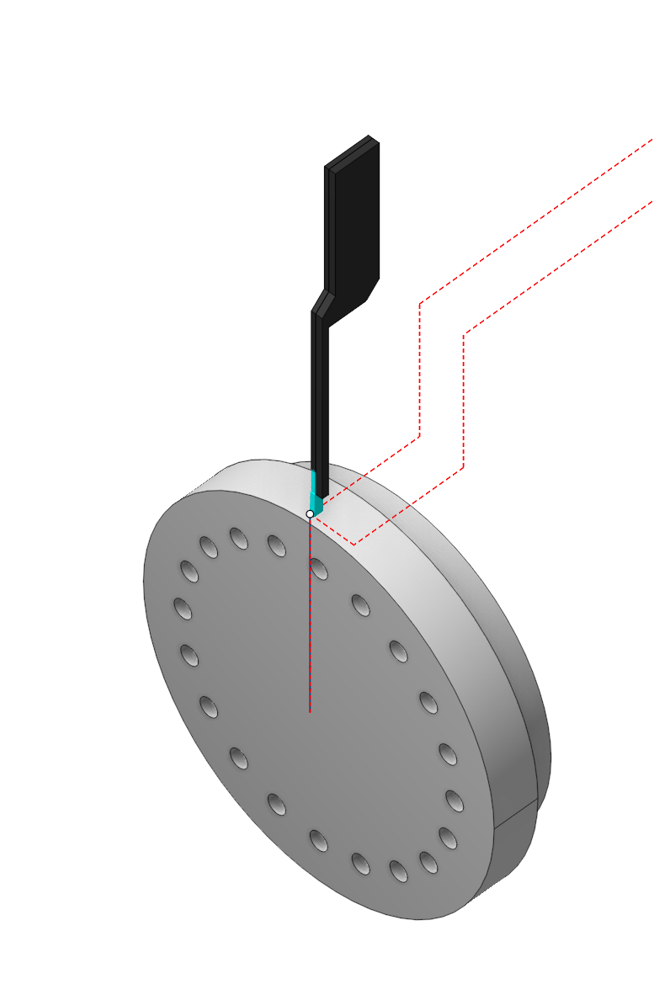
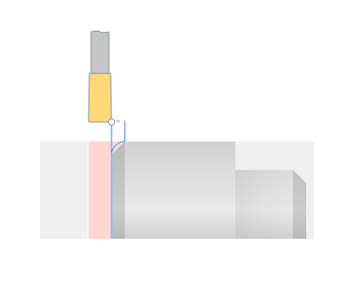
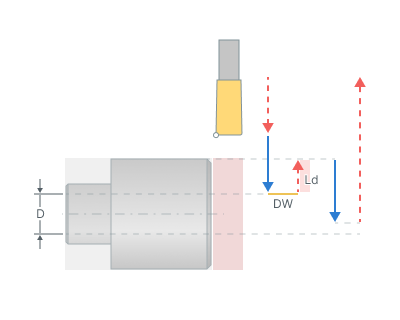

# Lathe part-off

## Application area:

The purpose of this operation is to cut off the processed part from the leftover workpiece material, while simultaneously forming the back end of the part, including creating a chamfer or radius on it. One can prepare the workpiece before parting off, for example, by machining a groove

### Setup:

The <strong>Setup</strong> tab is used to configure the primary parameters of the project. This can involve the positioning of the part on the equipment, the coordinate system of the part, and more. [Details](1022.md)

### Job assignment:

<strong>Part-off</strong> <strong>.</strong> Executes the cut off the processed part from the leftover material of the workpiece, while also machining the back face of the part <strong>.</strong> The system generates the working cycle's contour as a vertical line connecting the outer and inner diameters of the workpiece on the part's right or left side.

<strong>Profile.</strong> The system forms a single pass, the toolpath of which is identical to the geometric contour of the part. User can add engage/retract; shifting by stock values; tool unreachable gray zones excluding; tool radius compensating to the toolpath. [Details](10189.md)

<strong>Grooving cycle.</strong> The system outputs the part-off operation into the NC program as either an ISO G75 or ISO G74 cycle.

<strong>Slotting.</strong> This cycle efficiently machines simple rectangular grooves with a minimum number of actions. [Details](10196.md)

<strong>Grooves</strong> <strong>.</strong> This cycle is similar to Roughing, but it outputs the machining process to NC program as a cycle similar to ISO G71/ G72. [Details](10195.md)

<strong>Zigzag.</strong> <strong>The tool removes the rough stock</strong> layer by layer. In each layer, it plunges downwards to the cutting depth and performs horizontal movement. Thus, horizontal passes with alternating directions remove the entire rough stock, layer by layer. [Details](10201.md)

<strong>Properties.</strong> Displays the properties of the selected element. You can additionally add allowance. You can call the Properties menu by double-clicking on the selected element.

<strong>Delete.</strong> Removes an item from the list.

<strong>Restrictions.</strong> It allows you to restrict areas that should not be machined. [Details](101231.md)

### CycleParams:

#### Cycle.

You can select one of the available turning cycles described in the <strong>Job assignment</strong>. When you switch a cycle in this section, the corresponding element in the <strong>Job assignment</strong> automatically changes. The set of parameters varies for each turning cycle.

Click here to expand..

<strong>Smooth sharp edge.</strong> This feature specifies techniques for shaping the outer edge on the rear face of the machined part.

Click here to expand..

<strong>Off.</strong> The outer edge on the rear face of the part retains its original condition after previous operations.

<strong>Chamfer</strong> <strong>.</strong> The system forms a chamfer on the outer edge of the part's rear face.

<strong>Size</strong>. Input the size of the chamfer's leg.

<strong>Angle</strong>. Input the chamfer angle. Measure the angle from the vertical.

<strong>Make preparatory pass</strong>. Prior to the primary machining pass, the cutter makes a relief groove with a depth exceeding the chamfer dimension to avoid tool's side action during subsequent chamfer formation.

<strong>Rounding.</strong> The system forms a rounding on the outer edge of the part's rear face.

<strong>Size</strong>. Same as in <strong>Chamfer.</strong>

<strong>Make preparatory pass</strong>. Same as in <strong>Chamfer.</strong>

<strong>Reduce speed at the end.</strong> This option allows you to set the feed and spindle speed at the end of cut. For example, for cutting off heavy parts.

Click here to expand..

<strong>Diameter (D)</strong> <strong>.</strong> This parameter specifies the part diameter where speeds changes begin (<strong>See Reduce speed at the end hint</strong>).

<strong>Lead out (Ld).</strong> Upon reaching the specified Diameter, the tool idle retracts by the Lead out amount in radial terms, the new Spindle Speed is then set, and the tool resumes its movement towards the workpiece center with the new Spindle Speed and feed rate (<strong>See Reduce speed at the end hint</strong>).

<strong>Spindle speed.</strong> The revolution rate of the spindle, set at the end of the cut.

<strong>Delay(DW)</strong>. The dwell during which speed changes occur (<strong>See Reduce speed at the end hint</strong>).

<strong>Chip breaking</strong>. The system controls the mode of kinematic chip breaking in which, after a specified cutting length, the cutter retracts to stop the formation of continuous chip. Then the cutter engages again and continues cutting.

Click here to expand..

<strong>Depth step</strong> <strong>.</strong> Specify the cut depth after which the cutter retracts for chip breaking.

<strong>Lead out.</strong> Specify the cutter's return distance after stopping for chip breaking in the length units.

<strong>Delay</strong>. This feature controls feed stop. Activating this feature introduces a stop duration.

Click here to expand..

<strong>Off.</strong> The feed does not stop neither at the bottom, nor at every layer.

<strong>At the bottom</strong> <strong>.</strong> Feed stop occurs at the end of the entire cut's working pass.

<strong>At every layer</strong> <strong>.</strong> Feed stop occurs at each <strong>Step depth</strong> when <strong>Chip breaking</strong> mode is active.

<strong>Return to top level</strong>. When this flag is set, the tool returns to the start of the Job assignment, after completing the cut. Otherwise, the tool remains at the end of the cut off pass.

<strong>Counterspindle back off</strong> <strong>.</strong> This feature specifies the distance for the counterspindle move back after finishing the cut off.

Click here to expand..

<strong>Off.</strong> The system does not control counterspindle.

<strong>mm.</strong> The c ounterspindle back off is set in length units <strong>.</strong>

<strong>% width of tool.</strong> The counterspindle back off is set as a percentage of the cutting tool width.

<strong>Counterspindle axis</strong> <strong>.</strong> The machine axis name controlling the counterspindle movement.

<strong>Compensation.</strong> This parameter controls the method of outputting the cutter width and the tool length compensation.

Click here to expand..

<strong>Insert width compensation.</strong> Determines the method of outputting the cutter width.

<strong>On.</strong> The system takes into account the width of the cutter insert.

<strong>Off</strong>. The system doesn't take into account the width of the insert. When using this mode on complex contours, the undercuts or incomplete machining are possible, so it is necessary to be carefully when machining simulation.

Some parameter group works similarly to the <strong>OD Roughing and ID Roughing operations.</strong> [Details](316.md)

### Feeds/Speeds:

Using this dialogue the user can define the spindle rotation speed; the rapid feed value and the feed values for different areas of the toolpath. Spindle rotation speed can be defined as either the rotations per minute or the cutting speed. The defining value will be underlined. The second value will be recalculated relative to the defining value, with regard to the tool diameter. [Details](100142.md)

### Transformations:

Parameter's kit of operation, which allow to execute converting of coordinates for calculated within operation the trajectory of the tool. [Details](10168.md)

### Part:

A Part is a group of geometrical elements that defines the space to check for gouges. [Details](330.md)

### Workpiece:

A workpiece model of an operation defines the material to be machined. [Details](738.md)

### Fixtures:

As the Fixtures the fixing aids such as chucks, grips, clamps, etc., and the restriction areas of any other nature are usually specified. [Details](10283.md)
