# OD Roughing and ID Roughing

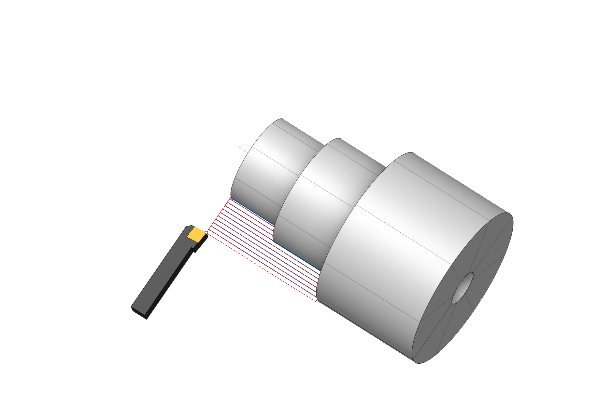 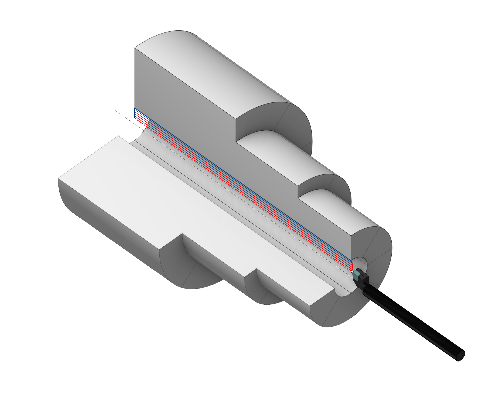

## Application area:

OD roughing, and ID roughing operations are designed to get the intermediate part by removing a lot of the workpiece volume that is located outside of the part and fixtures. The tool removes material by the series of the parallel strokes. The strokes can be parallel or perpendicular to the revolution axis depending on using cycle type and its parameters.

### Setup:

The <strong>Setup</strong> tab is used to configure the primary parameters of the project. This can involve the positioning of the part on the equipment, the coordinate system of the part, and more. [Details](1022.md)

### Job assignment:

<strong>Roughing.</strong> The roughing allowance is removed by tool movements along the axis of the workpiece (when processing surfaces elongated in the direction of the Z-axis) or perpendicular to it (when processing surfaces elongated in the direction of the X-axis). In other words, a trajectory is formed similar to ISO G71/G72, but it is output to the control program in an expanded form, without the use of a cycle. [Details](10192.md)

<strong><strong>Roughing cycle.</strong></strong> Similar to <strong>rough</strong> machining, but the operation is output to the control program in the form of a cycle, similar to ISO G71/G72. The roughing cycle allows the creation of one of the ISO G71 or ISO G72 cycles based on the specified contour of the workpiece. Switching between G71 and G72 is achieved by changing the <strong>Direction</strong> of tool movements (along the axis of the workpiece <strong>Axial</strong> or perpendicular to it <strong>Radial</strong>) in the parameters. [Details](10193.md)

<strong>Offset Roughing.</strong> The roughing allowance is removed by tool movements equidistant to the contour of the workpiece. In other words, a trajectory is formed similar to ISO G73, but it is output to the control program in an expanded form, without the use of a cycle. [Details](10190.md)

<strong>Offset cycle.</strong> Similar <strong>Offset Roughing</strong>, the operation is output to the control program in the form of a cycle, similar to ISO G73. [Details](10191.md)

<strong>Zigzag.</strong> This process is used for machining enclosed areas from both sides, using a neutral tool. The tool is engaged by plunging downwards and performs a horizontal movement to remove the next layer. The tool re-engages by plunging again and makes a horizontal pass in the opposite direction. This way, the entire roughing allowance is removed layer by layer through horizontal passes with alternating directions. [Details](10201.md)

<strong>Profile.</strong> This is the simplest type of cycle, where a single pass is generated, and its trajectory is identical to the specified initial geometric contour of the workpiece. Only minor modifications to the contour can be performed, including approach and retract linking, offsetting by specified allowances, excluding shaded areas that cannot be reached by the designated tool, and compensating for the tool radius. [Details](10189.md)

<strong>Facing.</strong> This allows programming the machining of the end face of a workpiece with a single command. The trajectory is formed in the same way as when specifying Contour or Contour Repeat cycles. However, the trajectory is automatically calculated based on the current blank and workpiece, ensuring correct machining of either the left or right end face. [Details](10194.md)

<strong>Properties.</strong> Displays the properties of an element. It is possible to add the stock. You can also call this menu by double clicking on an item in the list.

<strong>Delete.</strong> Removes an item from the list.

<strong>Restrictions.</strong> It allows you to restrict areas that should not be machined. [Details](101231.md)

### CycleParams:

#### Cycle.

You can select one of the available turning cycles described in the <strong>Job assignment</strong>. When you switch a cycle in this section, the corresponding element in the <strong>Job assignment</strong> automatically changes. The set of parameters varies for each turning cycle.

Click here to expand..

Here are the key parameters, the set of which may vary depending on the chosen strategy in the <strong>Cycle</strong> section:

<strong>Direction.</strong> Property switch between G71 and G72.

<strong>Axial.</strong> Turning is carried out with moves parallel to the axis of the part. (G71).

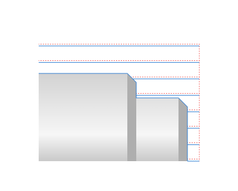

<strong>Radial.</strong> Turning is carried out with moves perpendicular to the axis of the part (G72).

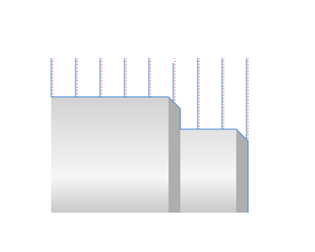

<strong>Step.</strong> The distance between tool passes is equal to the cutting depth.

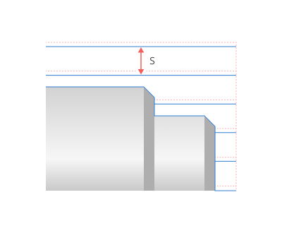

<strong>Overlap.</strong> When the flag is set, the system performs a semi-finish pass to remove the ridges remaining after the roughing passes.

.png) .png)

<strong>Safe distance.</strong> Specifies the distance, the tool retracts after a roughing pass. At this distance from the machined surface, the tool returns to its original position.

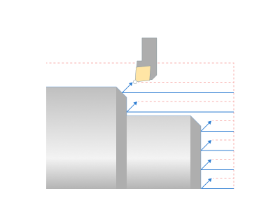

<strong>Leads in passes.</strong> When the flag is set, the tool performs the <strong>Engage</strong> in each working pass by the amount specified on the <strong>Links</strong> tab.

.png) .png)

<strong>Finish pass.</strong> When the flag is set, the system performs a finishing pass in the same operation.

.png) .png)

<strong>Stocks.</strong> This parameter leaves this allowance for subsequent machining. If the <strong>Finish pass</strong> flag is set <strong>,</strong> the system removes this allowance in the same operation.

Click here to expand..

<strong>Radial.</strong> A stock of a specified size appears on cylindrical surfaces. On conical and spherical surfaces, the allowance decreases in accordance with the angle of the surface normal. When setting both the radial and the axial stocks simultaneously, they combine quadratically on these surfaces.

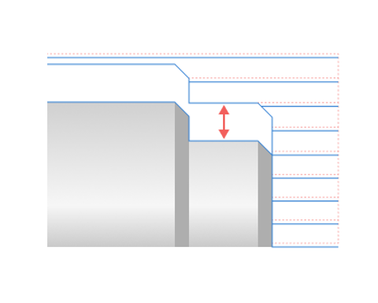

<strong>Axial</strong>. A stock of a specified size appears on faces. On conical and spherical surfaces, the allowance decreases in accordance with the angle of the surface normal. When setting both the radial and the axial stocks simultaneously, they combine quadratically on these surfaces

<strong>Profile.</strong> The toolpath with this allowance passes equidistantly to the contour of the part by a specified amount. All allowances combine when you set them simultaneously.

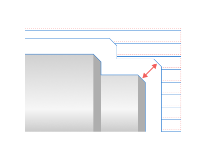

<strong>Chip breaking.</strong> Flagging activates the mode of kinematic chip breaking in which, after a specified cutting length, the cutter retracts to stop the formation of continuous chip. Then the cutter engages again and continues cutting. The retract distance is set in the <strong>Safe distance</strong> parameter.

Click here to expand..

<strong>Dwell.</strong> Allows you to break chips not by retract, but by stopping the feed of the cutter.

<strong>Off.</strong> When chip breaking by retract, the <strong>Dwell</strong> parameter is in the <strong>Off</strong> position.

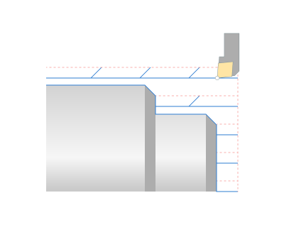

<strong>Revolutions.</strong> Stopping the cutter feed for a specified number of spindle revolutions performs the chip breaking.

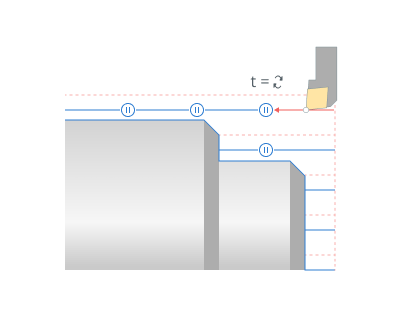

<strong>Seconds</strong>. Stopping the cutter feed for a specified time in seconds performs the chip breaking.

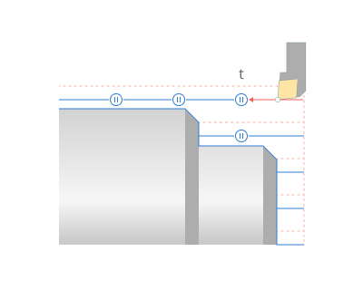

<strong>Radial thickness.</strong> The distance of relief in the X axis direction. Similar to the U parameter in the first block of the ISO G73 cycle.

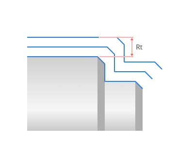

<strong>Axial thickness.</strong> The distance of relief in the Z axis direction. Similar to the W parameter in the first block of the ISO G73 cycle.

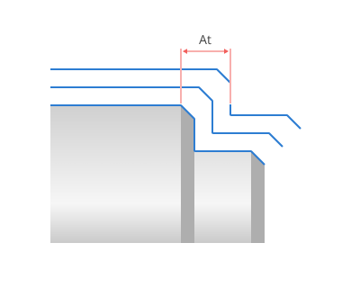

<strong>Pass count.</strong> The number of tool passes required to remove the rough stock. Similar to the R parameter in the first block of the ISO G73 cycle.

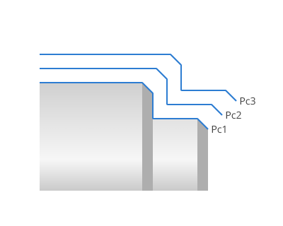

<strong>Start point.</strong> The tool is approaches to this point, from which the execution of the G 71, G 72, G 73 cycles begins, and to which the tool returns upon completion of the cycle. If the increments are zero, then the <strong>Start point</strong> is the intersection point of the lines drawn through the <strong>Engage</strong> and <strong>Retract</strong> points <strong>.</strong>

Click here to expand..

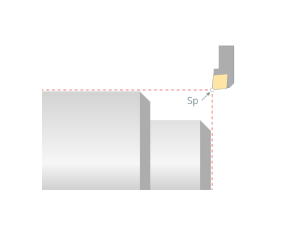

<strong>Radial increment.</strong> Shifts the <strong>Start point</strong> along the X-axis in the direction corresponding to the increment sign.

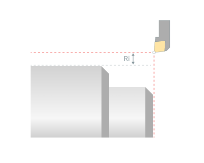

<strong>Axial displacement.</strong> Shifts the <strong>Start Point</strong> along the Z-axis in the direction corresponding to the increment sign.

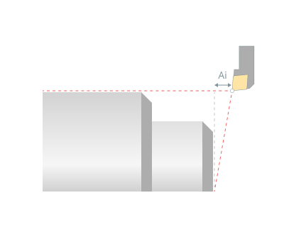

<strong>Check workpiece.</strong> When the flag is set, the system takes into account the current state of the workpiece. This significantly reduces machining time, especially if the shape of the allowance is complex. [Details](10190.md)

Click here to expand..

_turningop.png) _turningop.png)

<strong>Ignore gaps</strong>. Allows you to set the maximum distance of tool pass through the air at the working feed. If the length between two processing areas is less than this distance, the system will treat them as one processing area.

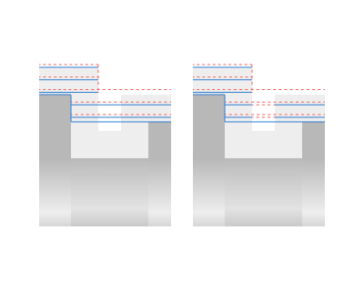

<strong>Safe distance.</strong> Specifies the distance of tool retract after a rough pass. At this distance from the machined surface, the tool returns to its initial position.

<strong>SD</strong> - Safe distance

<strong>Start entry amount</strong>. This parameter extends the beginning of the toolpath of the working passes.

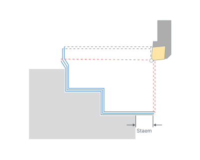

<strong>Staem</strong> - Start entry amount

<strong>Stop entry amount.</strong> This parameter extends the end of the toolpath of the working passes.

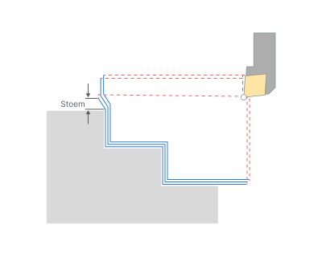

<strong>Stoem</strong> - Stop entry amount

<strong>Max traversal distance</strong>. Specifies the maximum distance that the tool can pass on the traversal feed. If the distance between areas exceeds this parameter, the system would treat them separately.

<strong><strong>Compensation:</strong></strong> This parameter controls tool offsets and the method of outputting the tool nose radius correction. [Details](350.md)

Click here to expand..

<strong>Length corrector.</strong> Controls the output to the program of tool offset numbers that are specified in the <strong>Tools – Tool Properties – Numbers.</strong>

<strong>First</strong>. If the <strong>First</strong> parameter is selected, the system outputs the <strong>1st corrector's</strong> number to the NC program.

<strong>Second.</strong> If the <strong>Second</strong> parameter is selected, the system outputs the <strong>2nd corrector's</strong> number to the NC program.

<strong>Compensation</strong>. Controls tool nose radius compensation.

<strong>Off.</strong> The contour of the toolpath corresponds to the contour of the part and is output to the NC program without considering the tool nose radius. When using this mode on complex contours, the undercuts or incomplete machining are possible, so it is necessary to be carefully when machining simulation.

<strong>Computer</strong>. When traversing segments of the part contour that are not linear sections parallel to the coordinate axes, the toolpath shifts by the tool nose radius.

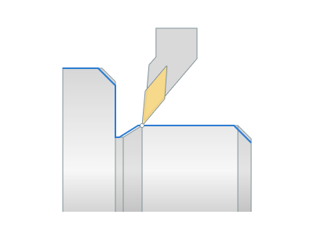

<strong>Control</strong>. The contour of the toolpath corresponds to the contour of the part and is output to the NC program without considering the tool nose radius. The system includes the commands for enabling and disabling correction (ISO G41/42/40) before the engage and retract frames respectively.

<strong>Wear</strong>. The system transforms the part contour geometry to the toolpath as in the <strong>Computer</strong> mode, but also includes commands for enabling and disabling correction, as for the <strong>Control</strong> mode. The tool moves closer to the part by the tool wear value entered in the NC console.

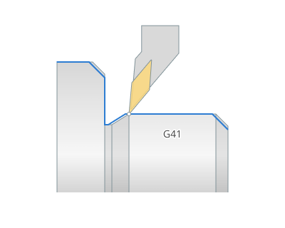

<strong>Reverse wear.</strong> It differs from <strong>the Wear</strong> mode in the direction of correction - G42 instead of G41, or vice versa. The tool moves away from the part by the tool wear value entered in the NC console.

The parameters for the <strong>Zigzag</strong> cycle works similarly to the <strong>OD Grooving, ID Grooving and Face grooving operations.</strong> [Details](312.md)

#### Roll by arcs.

Click here to expand..

<strong>If enabled:</strong> When rolling by arc, an arc whose radius is equal to the offset value will be inserted into the toolpath.

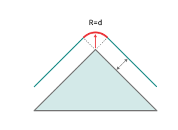

<strong>If disabled:</strong> In the tangent mode, linear moves are used to transit the corner. The tool path before and after the corner is extended by the offset length. If the extended path intersects then it is truncated to the intersection point, else a connection move is created.

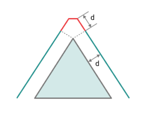

### Feeds/Speeds:

Using this dialogue the user can define the spindle rotation speed; the rapid feed value and the feed values for different areas of the toolpath. Spindle rotation speed can be defined as either the rotations per minute or the cutting speed. The defining value will be underlined. The second value will be recalculated relative to the defining value, with regard to the tool diameter. [Details](100142.md)

### Transformations:

Parameter's kit of operation, which allow to execute converting of coordinates for calculated within operation the trajectory of the tool. [Details](10168.md)

### Part:

A Part is a group of geometrical elements that defines the space to check for gouges. [Details](330.md)

### Workpiece:

A workpiece model of an operation defines the material to be machined. [Details](738.md)

### Fixtures:

As the Fixtures the fixing aids such as chucks, grips, clamps, etc., and the restriction areas of any other nature are usually specified. [Details](10283.md)
