# OD Threading and ID Threading

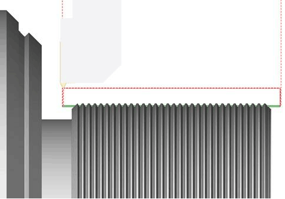

## Application Area:

Lathe threading operations are designed for the threading by turn cutter or thread chaser. Helical surface forming is performed by the simultaneous spindle rotation and linear tool motion. Operation allows to thread as standard types of a thread (metric, inch, pipe threads etc.), and threads with a non-standard tooth profile depend on tool shape (diameters, step and angles can be difened manually). To produce a thread with desired specifications, one must take three main actions: identify the positions of the start and end points in relation to the workpiece, configure the geometric parameters of the thread, and select a strategy for its processing. The thread location is defined in the [Job Assignment](10207.md) window. Where are a few steps to define the thread position: select the simple elements on a part geometry (curves and faces) where you want to make a thread, press the button with desired cycle type, then define the curve segment from the start to the end point. Each operation considers only one item from the Job Assignment. To process multiple threads, even with identical parameters, create as many operations as needed. By default thread diameters are taken from selected geometry. If you need to change it you can use properties of cycle or much easier to use graphical preview and threads table. Lathe threading cycles visualization exists. Interactive representation of the thread appears on the screen just after adding one of the threading cycles. Dimensions for thread pitch, depth top and bottom diameters, profile angles can be edited directly in the graphical screen. The simulation mode allows the checking of the thread shape. The cylindrical grooves are displayed instead the helical surface; because the simulation feature.

### Job Assignment:G01 X70 Z5.0 F1.0 M08

<strong>Threading</strong>. This option determines the location of the threaded section on the part. When you select this item, the system automatically generates the thread line on the part profile. You can interactively modify this line in the graphical window by moving the start and end points, changing the thread direction arrow, adjusting the threaded groove side arrow, and shifting the line to alter the external or internal diameter of the thread. Thread type - inner or outer - is specified by contour machining side (Perpendicular arrow near contour start point). Thread type - left or right - is specified by contour machining direction (Parallel arrow near contour start point) and spindle rotation direction. Contour approach and retract areas allows to set prolongation or chamfer for tool output. This feature activates continuous cylindrical, taper or face threading mode (G23/G33) with constant step. In this mode synchronization between tool movement and spindle rotation is enabled. All tool movements will processed in thread mode until the interpolation switching or rapid toolpath command will be detected. If tool moves parallel to the spindle rotation axis, cylindric thread will be formed. If tool moves both parallel and perpendicular to spindle rotation axis simultaneously, taper thread will be formed. It is possible to form special face thread, if tool moves perpendicular to spindle rotation axis. In this case groove looks like spiral of Archimedes will be formed at face. G32/G33 command does not generate any moves, so all working tool moves, approaches, retracts, transitions to the next passes should be specified separate parameters in the <strong>Strategy</strong> and <strong>Links</strong> tabs.

<details>
<summary>Click here to expand..</summary>

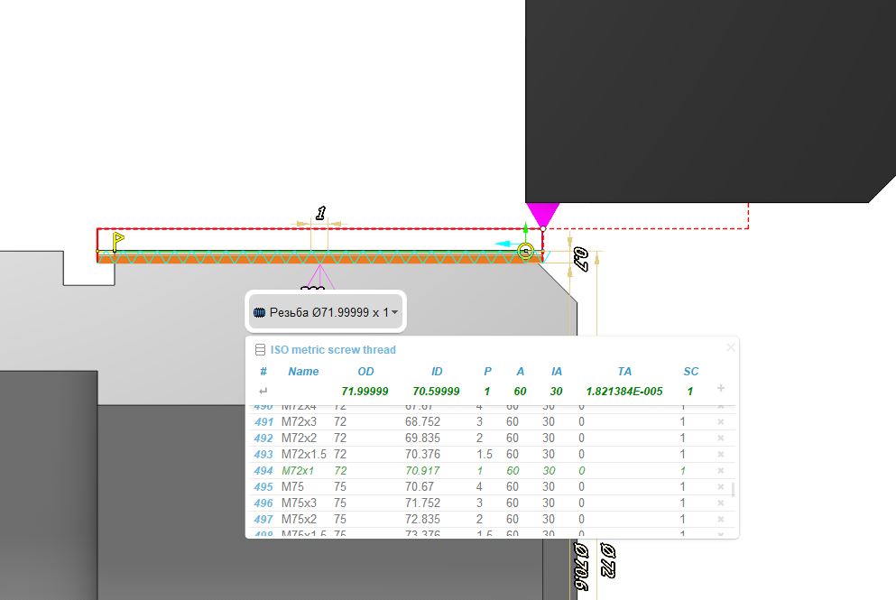

> > Example of NC program
>
> > ```
> > G00 X60.0 Z10.0 M08 (Approach to Start point) 
> > G00 X29.4           (Approach to start of pass 1)
> > G32 Z-52.0 F2.0     (Threading synchronized with spindle)
> > G00 X60.0           (Return to Start)
> > Z10.0 
> > X28.9               (Approach to start of pass 2)
> > G32 Z-52.0          (Threading synchronized with spindle)
> > G00 X60.0           (Return to Start)
> > Z10.0 
> > X28.5               (Approach to start of pass 3)
> > G32 Z-52.0          (Threading synchronized with spindle)
> > G00 X60.0           (Return to Start)
> > Z10.0 
> > X28.1               (Approach to start of pass 4)
> > G32 Z-52.0          (Threading synchronized with spindle)
> > G00 X60.0           (Return to Start)
> > Z10.0 
> > X27.8               (Approach to start of pass 5)
> > G32 Z-52.0          (Threading synchronized with spindle)
> > G00 X60.0           (Return to Start)
> > Z10.0 
> > X27.56              (Approach to start of pass 6) 
> > G32 Z-52.0          (Threading synchronized with spindle)
> > G00 X60.0           (Return to Start)
> > Z10.0 
> > X27.36              (Approach to start of pass 7)
> > G32 Z-52.0          (Threading synchronized with spindle)
> > G00 X60.0           (Return to Start)
> > Z10.0 
> > X27.26              (Approach to start of pass 8)
> > G32 Z-52.0          (Threading synchronized with spindle)
> > G00 X60.0           (Return to Start)
> > Z10.0
> > X200.0 Z150.0 M09   (Retract)
> > ```

</details>

<strong>Single thread cycle</strong>. This option also serves to define the position of the threaded section on the part. The system will output the G92 cycle to the NC program. It generates closed set of moves for one threading pass. Picture below shows processing schema. Before calling this cycle tool is in Start point. Cycle is called by one frame of NC-program, defines thread start point, step, taper size, chamfer size and others. As a result of this frame the tool goes from Start to TSP point, thread to TEP point and returns to Start point. Usually threading is processed by several passes, so NC-program consists several cycle calls with various thread diameters. Therefore, it can be used for both standard-shaped threads and free-form threads.

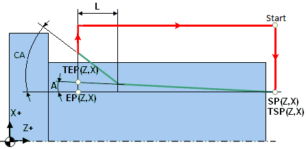

<details>
<summary>Click here to expand..</summary>

> > Example of NC program
>
> > ```
> > X60.0 Z20.0 M08 
> > G01 Z10.0 F1.0        (Approach to Start point)
> > G92 X29.4 Z-52.0 F2.0 (Calling cycle for one threading pass)
> > X28.9                 (Modal calling G92 cycle with another diameter value)
> > X28.5                 (Modal calling G92 cycle with another diameter value) 
> > X28.1                 (Modal calling G92 cycle with another diameter value)
> > X27.8                 (Modal calling G92 cycle with another diameter value)
> > X27.56                (Modal calling G92 cycle with another diameter value)
> > X27.36                (Modal calling G92 cycle with another diameter value)
> > X27.26                (Modal calling G92 cycle with another diameter value)
> > G00 X200.0Z150.0M09   (Retract)
> > ```

</details>

Thread Cycle. This option also serves to define the position of the threaded section on the part. The system will output the ISO G76 multipass thread cycle to the NC program. It uses a single frame of the NC-program to set all parameters necessary for machining a standard form thread. Required depth is reached automatically by generating several passes. Among the parameters of the cycle there are start (TSP) and finish point (TEP) coordinates, taper angle (A, for taper threads), size of chamfer for tool out (L, CA), profile angles, thread depth (H), passes count, plunge strategy and others. You can configure these parameters interactively in the graphic window on the J <strong>ob Assignment</strong> tab or enter their numerical values on the <strong>Cycle Parameters</strong> tab. See NC control documentation for more information.


<details>
<summary>Click here to expand..</summary>

> > Example of NC program
>
> > ```
> > G01 X70 Z5.0 F1.0 M08            (Approach to start point)
> > G01 X70 Z5.0 F1.0 M08            (Approach to start point)
> > G76 P010060 
> > G76 X57.4 Z-24.0 P1.3 Q0.35 F2.0 (Calling G76 multipass thread cycle) 
> > G00 X200.0 Z150.0 M09            (Retract)
> > ```

</details>

### Cycle Prarameters:

#### Cycle.

You can select one of the available turning cycles described in the <strong>Job Assignment</strong>. When you switch a cycle in this section, the corresponding element in the <strong>Job Assignment</strong> automatically changes. The set of parameters varies for each turning cycle.

<details>
<summary>Click here to expand..</summary>

<strong>Clearance Stock</strong>. Specifies the distance from the thread to the transitions level. The cycle goes through this level while moving from the end of the previous pass to the start of the next one.

<strong>Thread Form.</strong> The group configures the geometric parameters of the thread.

<details>
<summary>Click here to expand..</summary>

<strong>Thread Libray</strong>. Select thread parameters from the database if the parameters for the thread conform to standard ones. There is no need to enter all parameters manually. Just establish the type of thread and select its designation from the dropdown list. The database will automatically complete the remaining parameters with standard values. You can access the thread parameter table from the <strong>Job Assignment</strong> tab by clicking the thread profile with the left mouse button. Pop-up action bar with the thread name, that appears when you select cycle item, allows to open threads table quickly and select one of the standard threads. The list of threads can be modified in this panel intuitively.

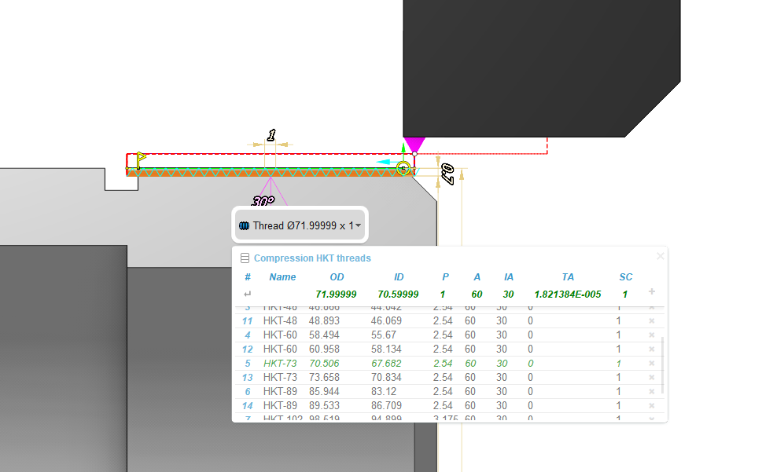

The operation with standard thread types remains identical in both cases:

<details>
<summary>Click here to expand..</summary>

Click on the table header to select the desired thread type. Implement a database with your thread type by entering the file path in the "Add new file" field. The following fields appear in the table:

<strong>#</strong>. Record Number

<strong>Name</strong>. Thread Type Designation

<strong>OD</strong>. Outer Thread Diameter

<strong>ID</strong>. Inner Thread Diameter

<strong>P</strong>. Thread Pitch

<strong>A</strong>. Thread Profile Angle

<strong>IA</strong>. Inclination Angle - defines the inclination of one side of the thread profile relative to the vertical

<strong>TA</strong>. Taper Angle (for tapered threads)

<strong>SC</strong>. Number of Starts (for multi-start threads)

<strong>+</strong>. Allows you to add a new row. A new row appears after the row where the cursor is located.

</details>

<strong>Symbolic Name</strong>. It's just an optional symbolic designation of the thread type and size, M10 for example. You can use it to quick search the thread in the threads' table. You can enter your own designation for non-standard threads.

<strong>Thread Pitch</strong>. The distance between adjacent identical points of the thread profile on the one helical line. Specify the thread pitch either in length units or as the number of threads per length unit.

<strong>Depth</strong>. Defines thread profile height (difference between outer and inner diameters). This value must have positive value.

<strong>Thread Angle</strong>. Specifies t he angle between two adjacent sides of the groove profile.

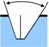

<strong>Inclination Angle.</strong> Specifies the inclination of one profile side of the thread groove relative to the vertical.

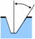

The <strong>Thread Angle</strong> and <strong>Inclination Angle</strong> parameters define angle of tool plunge at each pass. if plunge mode is <strong>Flank</strong> or <strong>Alternative Flank</strong>. The thread profile formed during machining largely depends on the tool's shape and position. The profile angles set on the <strong>Thread Form</strong> page are used for toolpath calculation, but they do not synchronize with the tool orientation, so it is essential to monitor the tool properties specified on the <strong>Tool</strong> tab.

<strong>Chamfer.</strong> The tool exits the workpiece at the end of the cutting stroke. This feature guarantees an accurate completion of the screw thread surface if there is no exit groove for the cutting tool on the relevant side of the thread.

<strong>Auto by Retract</strong>. The system defines the tool exit using exit segments that they set interactively in the graphical interface of the <strong>Job Assignment</strong> tab.

<strong>Length</strong>. Specifies the length of the thread exit in length units.

<strong>% of Lead</strong>. Specifies the length of the thread exit as the percent of the <strong>Thread Pitch</strong>.

<strong>Angle</strong>. Specifies the angle of the exit section relative to the horizontal.

<strong>Number of starts.</strong> Specifying two or more starts results in the cutting of a multi-start thread. Various cycle types use Number of starts differently. In ISO G76 numbers of starts send to cycle as a parameter. But some machines have not this parameter in cycle. In this case it is possible to create multistart threads by making the same cycle with another <strong>Spindle start angle</strong> parameter value. Another way is using ISO G92 or ISO G32/33. In this case operation automatically generates passes with different spindle start angles.

<strong>Spindle Start Angle</strong>. Specifies the angle from the X-axis where the thread's helical line cutting starts.

</details>

<strong>Sequence</strong>. Defines plunge mode for each pass. Practically thread is processed by several passes. It allows to improve surface quality and reduce tool loading.

<details>
<summary>Click here to expand..</summary>

<strong>Radial</strong>. The direction of plunge is perpendicular to the axis of rotation.

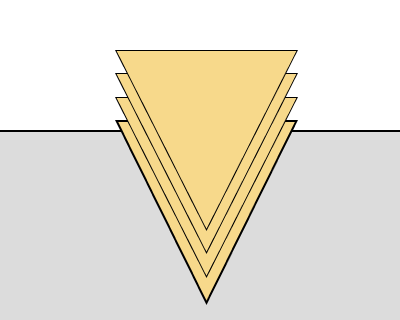

<strong>Flank</strong>. The plunge is made along one side of the thread groove.

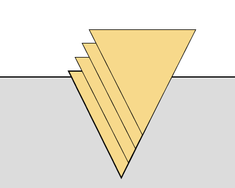

<strong>Alternate Flank</strong>. Plunge is made alternately along the two lateral sides of the thread groove.

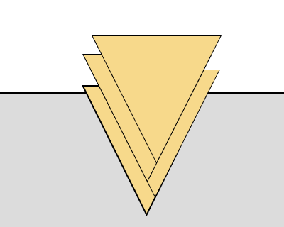

<strong>Modified flank.</strong> Plunge is made with angle, specified at <strong>Angle</strong> parameter.

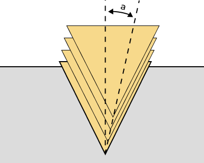

<strong>Determine Cut Depth From.</strong> Controls the method for setting cutting depths. When cutting depths are equal across different layers, advancing to the next layer usually alters the area of material removed by the tool, and consequently, changes the load on the tool. To maintain a consistent tool load, one can calculate the cutting depth based on keeping the area of material cut by the tool constant.

<strong>Equal Area</strong>. In this mode cutting depth decreases at each level t o ensure a constant removal area of the layer.

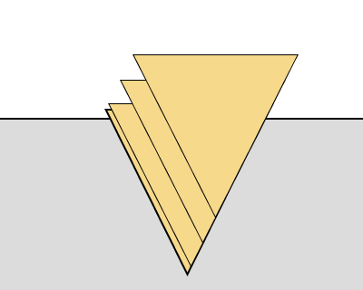

<strong>Equal depth</strong>. The cutting depth is constant at each layer.


You can set the number of rough passes by directly specifying their <strong>Number</strong> or by indicating the <strong>Amount of First Cut</strong>.

<strong>Number of Cuts</strong>. Specify the count of roughing passes.

<strong>Amount of First Cut</strong>. Specify the cutting depth for the first pass.

<strong>Minimal Cut Depth</strong>. If the calculated depth on any pass becomes less than this value, then the minimal cut depth will be used.

<strong>Finish Pass Count</strong>. Specify the count of finish passes. Usually, finishing passes aim to enhance the quality of the formed surface. In threading operations, there are two types of finishing passes: the direct finishing pass and burnishing. You can enable or disable the finishing pass, but it is always one, with its depth specified in the relevant field. Burnishing, unlike the finishing pass, is performed with no cutting depth and effectively duplicates the toolpath of the previous pass.

<strong>Finish Pass Depth</strong>. Defines finish pass stock.

</details>

<strong>Compensation.</strong> This parameter controls the method of outputting cutter width compensation.

<details>
<summary>Click here to expand..</summary>

<strong>Length corrector.</strong> Controls the output to the program of tool offset numbers that are specified in the <strong>Tools – Tool Properties – Numbers.</strong>

<strong>First</strong>. If the <strong>First</strong> parameter is selected, the system outputs the <strong>1st corrector's</strong> number to the NC program.

<strong>Second.</strong> If the <strong>Second</strong> parameter is selected, the system outputs the <strong>2nd corrector's</strong> number to the NC program.

</details>

</details>

#### Roll by arcs.

The system rounds the external corners of the toolpath by arcs with a radius equal to the tool nose radius. The parameters group works similarly to the <strong>OD Roughing and ID Roughing operations.</strong> [Details](316.md).

### Feeds/Speeds:

Using this dialogue the user can define the spindle rotation speed; the rapid feed value and the feed values for different areas of the toolpath. Spindle rotation speed can be defined as either the rotations per minute or the cutting speed. The defining value will be underlined. The second value will be recalculated relative to the defining value, with regard to the tool diameter. [Details](100142.md)

### Transformations:

Parameter's kit of operation, which allow to execute converting of coordinates for calculated within operation the trajectory of the tool. [Details](10168.md)

### Part:

A Part is a group of geometrical elements that defines the space to check for gouges. [Details](330.md)

### Workpiece:

A workpiece model of an operation defines the material to be machined. [Details](738.md)

### Fixtures:

As the Fixtures the fixing aids such as chucks, grips, clamps, etc., and the restriction areas of any other nature are usually specified. [Details](10283.md)
